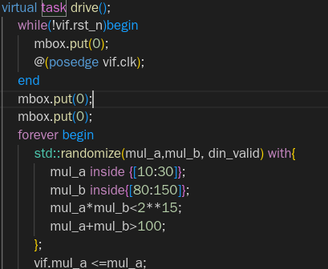

注意程序出口，finish的问题。

Q：复位前信号不想采集

A：在drive模块中更改，等待复位后，再随机化数据。并延迟2拍对齐数据。在driver前面加一个复位task

Q: 静态语法检查问题

A:不用静态语法检查，直接用编译器查

Q:在interface的clocking里，使用@negedge的时钟，但是在DUT里，都是posedge

A:这个没关系，我们还是posedge就可以。芯片后端在器件原则上，器件本身有些会用低电平reset，或者下降沿时钟驱动，在工具综合的时候会在前边插入反向器，几乎没有开销

Q:编译与运行，有些代码是不是编译时候不管，运行才管，比如

A:plusarg都是runtime option，留给用户的接口，不用你自己去解析main函数后吃的选项，可以通过vcs -full64 -h查看vcs支持的compile option和runtime option

Q:

Q:pars文件的顺序

先rtl库，再rtl，再tb库，再tb，是filelist里的顺序，被调用的写前边，文件顺序写的不对，会报错

-ntb_opts uvm-1.1 -ntb_opts svp