 https://zhuanlan.zhihu.com/p/135183491


可以看到，这里先使用的gitee仓库拉取更新成功，但是后面使用的github拉取更新显示失败。由于这是两个不同的仓库，无论谁后被pull更新，都会失败。
失败原因：refusing to merge unrelated histories（拒绝合并两段不相关的历史）
由此，测试push也必然失败。

4、解决方法
经过简单的思考，笔者采用以下两种解决办法：
方法一：强制融合两段不相干的分支历史：

git pull github master --allow-unrelated-histories
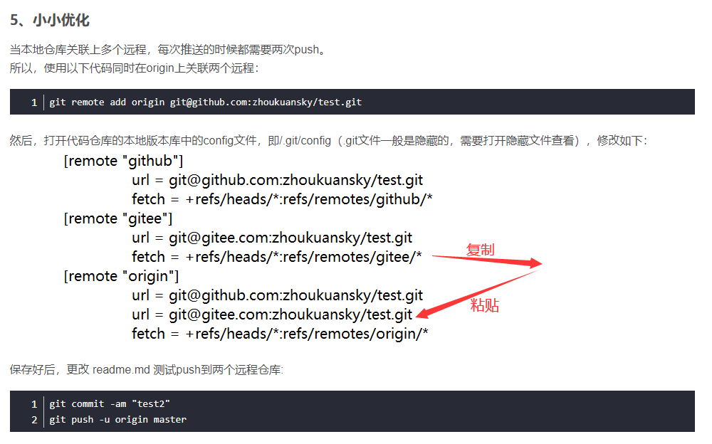

### git代理

git config --global http.proxy socks5 127.0.0.1:1080
git config --global https.proxy socks5 127.0.0.1:1080

git config --global http.proxy 127.0.0.1:1080
git config --global https.proxy 127.0.0.1:1080
1080->7890

### OpenSSL SSL_read: 

Connection was reset, errno 10054
问题原因
首先出现这个问题，导致不能正常上传文件到github是很烦心的，网上找了下遇到类似情况的大家的处理方案，有的说是由于网络不稳定造成的，个人觉得有这方面的原因，因为github提交的时候这个错误不是一定会出来的，为了稳妥起见还是把ssl验证关了方便些。

git config --global http.sslVerify "false"

### ! [rejected]        master -> master (fetch first)

正确的解决方法就是将你的仓库和你的gitee合并了，用填充的方法，即：

git pull --rebase origin master

输入上述命令，其中origin代表你的仓库uri，后面的master表示将当前的提交到本地仓库的内容和远程仓库合并；
再输入如下命令，即可将本地仓库推送到远程仓库：

git push origin master

### fatal: refusing to merge unrelated histories

解决办法是：
在git pull和git push命令中添加–allow-unrelated-histories
让git允许提交不关联的历史代码。

git pull origin master --allow-unrelated-histories

git push origin master --allow-unrelated-histories

一、pull操作
1、将远程指定分支 拉取到 本地指定分支上：
git pull origin <远程分支名>:<本地分支名>
2、将远程指定分支 拉取到 本地当前分支上：
git pull origin <远程分支名>
3、将与本地当前分支同名的远程分支 拉取到 本地当前分支上(需先关联远程分支，方法见文章末尾)
git pull
在克隆远程项目的时候，本地分支会自动与远程仓库建立追踪关系，可以使用默认的origin来替代远程仓库名，
所以，我常用的命令就是 git pull origin <远程分支名>，操作简单，安全可控。

回到顶部
二、push操作
1、将本地当前分支 推送到 远程指定分支上（注意：pull是远程在前本地在后，push相反）：
git push origin <本地分支名>:<远程分支名>
2、将本地当前分支 推送到 与本地当前分支同名的远程分支上（注意：pull是远程在前本地在后，push相反）：
git push origin <本地分支名>
3、将本地当前分支 推送到 与本地当前分支同名的远程分支上(需先关联远程分支，方法见文章末尾)
git push
同样的，推荐使用第2种方式，git push origin <远程同名分支名>

// 将本地分支与远程同名分支相关联

git push --set-upstream origin <本地分支名>

git config --global http.sslVerify "false"

解除ssl认证

git init

add

status

diff

commit

log

reflog

checkout

 命令git checkout -- readme.txt 中的 -- 很重要，如果没有 -- 的话，那么命令变成创建分支了。

checkout -b branchname

branch

merge

查看分支：git branch

创建分支：git branch name

切换分支：git checkout name

创建+切换分支：git checkout –b name

合并某分支到当前分支：git merge name

删除分支：git branch –d name


```text
git remote add origin https://github.com/Irelia1/git_my.git
git push -u origin master
git push origin master
```


我想把当前的版本回退到上一个版本，要使用什么命令呢？可以使用如下2种命令，第一种是：git reset --hard HEAD^ 那么如果要回退到上上个版本只需把HEAD^ 改成 HEAD^^ 以此类推。那如果要回退到前100个版本的话，使用上面的方法肯定不方便，我们可以使用下面的简便命令操作：git reset --hard HEAD~100 即可。


著作权归作者所有。商业转载请联系作者获得授权，非商业转载请注明出处。

 执行git add 和 git diff命令时会提示

警告:LF将被readme.txt中的CRLF替换。

该文件将在工作目录中以其原始行结尾。

出现此问题是因为不同操作系统的使用的换行符不同：

Linux / Unix 采用换行符LF表示下一行

Windows  采用回车+换行 CRLF表示下一行

解决：可以通过设置 core.autocrlf 的值解决

$ git config --global core.autocrlf false    # 关闭自动转换 


### 2.4 git命令大全

git config core.autocrlf false：只在当前仓库生效，将自动替换换行符的功能关掉

git config --global core.autocrlf false：在所有仓库有效，将自动替换换行符的功能关掉

git init ：初始化一个本地仓库

git add . :将工作区的所有文件添加到暂存区index

git add [文件名] ：将工作区的某个文件添加到暂存区

git add *.c ：git add命令支持模式匹配，利用多字符通配符*将工作区所有c文件加入暂存区

git commit -m “***”  :将当前暂存区的文件提交到当前分支，并注释提交信息

git commit -am “***” :将工作区中已经被追踪的文件添加到暂存区并提交和注释提交说明

 

 

git commit --amend :修改提交信息，一般进入vim编辑器编辑，会改变提交的哈希值

git commit --amend -m “***” :修改提交信息，不用进入编辑器，会改变提交的哈希值

git branch :查看本地仓库所有分支

git branch -r :查看远程仓库所有分支

git branch -a :查看远程仓库和本地仓库所有分支

git branch –all   :功能和git branch -a 一样

git branch [分支名]  ：创建新的分支名字

git branch --set-upstream-to=[远程仓库名]/[远程分支名] [本地分支名] ：建立本地分支和远程分支的联系

git branch --unset-upstream [被取消远程关联的本地分支名]：删除本地分支与远程分支的远程跟踪关联，如果不填写[被取消远程关联的本地分支名]，那么默认取消当前分支与远程分支的远程跟踪关联。

git branch -u [远程仓库名]/[远程分支名] [本地分支名]：建立起本地分支和远程分支之间的追踪

git branch -m [旧名字] [新名字]/ git branch -M [旧名字] [新名字]：对分支进行重命令，如果新名字已经存在，则需要使用-M强制修改

git branch -d [本地分支名] ：删除合并到当前分支的本地分支

git branch -D [本地分支名]：删除没有合并到当前分支的本地分支

git branch -dr [远程仓库名][远程分支名]：删除本地的远程分支，如果要删除远程仓库的分支，还要使用git push [远程仓库名] ：[远程分支]

git branch -v :查看本地分支和上次提交的信息

git branch -vv   :查看本地分支和上次提交的信息，以及远程的分支和本地分支的关系

git branch --merge :查看合并到当前分支的本地分支

git branch --no-merge :查看没有合并到当前分支的本地分支

git branch --contain 565464 :显示包含提交565464的分支

git help [命令名]：查看命令的帮助文档

git [命令名] --help : 查看命令的帮助文档

git clone [url/ssh] :克隆远程仓库

git status :查看当前版本状态

git diff : 当工作区有改动，临时区为空，diff的对比是“工作区与最后一次commit提交的仓库的共同文件”；当工作区有改动，临时区不为空，diff对比的是“工作区与暂存区的共同文件”

git diff --cache或git diff --staged: 显示暂存区(已add但未commit文件)和最后一次commit(HEAD)之间的所有不相同文件的增删改

git diff [分支名1] [分支名2]：比较两个分支的不同，详细信息

git diff [分支名1] [分支名2] --stat：比较两个分支的哪些文件不同，没有详细信息

git diff [分支名1] [分支名2] [文件路径]：比较两个分支指定路径文件的不同。

git diff HEAD :比较工作目录和上一次提交的不同

git diff [远程仓库名]/[远程分支名] [本地分支名]：比较远程仓库分支和本地分支的不同，可以添加—stat参数只显示哪些文件不同

git log : 默认会输出commit hash, author, date, commit message.

git log --oneline:简化的git log 输出

git log --stat:在git log的基础上增加文件增删改的统计数据

git log -p: 控制输出每个commit具体修改的内容，输出的形式以diff的形式给出

git log -n:控制输出多少个log内容

git reflog:显示所有提交，包括孤立节点

git shortlog：这个命令用来输出汇总信息，以作者进行分类

git shortlog -s：可以用来统计每个作者的commit数量

git shortlog -n：可以用来对统计的量进行倒序排列

git show: git show命令同git log -p输出类似，只不过它只显示一个commit的内容，如果不指定commit hash, 它默认输出HEAD指向commit的内容.

git show-branch:图示当前分支历史

git show-branch --all;图示所有分支历史

git checkout [分支名]：切换到对应的分支名

git checkout -b [分支名]:创建一个新的分支并切换过去

git checkout [某次commit的哈希值]：将某次提交检出到工作区

git checkout . :没有指定某次commit的哈希值则会把暂存区的所有文件恢复到工作区

git checkout  --[文件名]：从暂存区恢复指定的文件到工作区,也可以包含文件路径

git switch [分支名]：切换到对应的分支名

git switch -c [分支名]：创建一个新的分支并切换过去

git merge [分支名]：合并一个指定的分支名到当前分支上

git merge --no-ff [分支名]：表示禁用Fast forward;可以保存之前的分支历史。能够更好的查看merge历史，以及branch状态.

保证版本提交、分支结构清晰

git rebase [分支名]：合并一个指定的分支名到当前分支上，注意和git merge 的区别

git rebase -i HEAD[相对应用]：以交互的方式改变提交顺序

git reset --soft或--mixed或--hard [某次提交哈希值] ：soft参数只告诉Git将其他的commit重置到HEAD，就仅此而已。index和working copy中的文件都不改变。mixed 改变HEAD和index，指向那个你要reset到的commit上。而working copy文件不被改变。当然会显示工作目录下有修改，但没有缓存到index中。hard HEAD & index & working copy同时改变到你要reset到的那个commit上。这个参数很危险，执行了它，你的本地修改可能就丢失了

git revert HEAD：做一个新的提交来改写指定的版本

git push --all [远程仓库名]：不管是否存在对应的远程分支，将本地的所有分支都推送到远程主机，这时需要使用–all选项

git push [远程仓库名] [本地分支名]:[远程分支名]：将指定的本地分支push到指定的远程分支，如果省略本地分支相当于删除指定的远程分支名。如果省略远程分支名，则表示将本地分支推送与之存在"追踪关系"的远程分支（通常两者同名），如果该远程分支不存在，则会被新建。如果当前分支与远程分支之间存在追踪关系，则本地分支和远程分支都可以省略。如果当前分支只有一个追踪分支，那么远程仓库名都可以省略。如果当前分支与多个主机存在追踪关系，则可以使用-u选项指定一个默认主机[git push -u origin master]，这样后面就可以不加任何参数使用git push

git push [主机名] -d [分支名]或者git push [主机名] --delete [分支名]:删除远程的某个分支

git rm a.a :移除文件(从暂存区和工作区中删除)

git rm --cached a.a: 移除文件(只从暂存区中删除)

git rm -r --cached . : 移除暂存区中所有的文件(只从暂存区中删除)

git rm -f a.a ：添加-f参数表示强制删除工作区中的文件，当工作区中的文件经过修改后，再想使用 git rm 命令时，就需要添加 -f 参数，表示强制删除工作区中的文件，并将删除添加到暂存区。

git remote add origin git@github.com:daixu/WebApp.git: 增加一个远程服务器端

git remote -v: 查看远程仓库

git remote add [自定义远程仓库名] [url] :添加远程仓库：

git remote rm [远程仓库名] :删除远程仓库

git remote set-url --push [新的自定义远程仓库名] [newUrl] :修改远程仓库

git pull：按照git branch 设置的默认跟踪的服务器和分支来拉取。

git pull [远程仓库名] [远程分支名]:[本地分支名]: 将远程指定分支 拉取到本地指定分支上,

git fetch : 这将更新git remote 中所有的远程仓库所包含分支的最新commit-id, 将其记录到.git/FETCH_HEAD文件中

git restore：指令使得在工作空间但是不在暂存区的文件撤销更改(内容恢复到没修改之前的状态)

git restore –staged：将暂存区的文件从暂存区撤出，但不会更改文件的内容

git cherry-pick ff44785404a8e：合并提交ff44785404a8e的修改

git stash暂存当前修改，将所有至为HEAD状态

git stash list:查看所有暂存

git stash show -p stash@{0}:参考第一次暂存

git stash apply stash@{0}:应用第一次暂存

git tag [标签名]：创建一个本地标签名

git push [远程仓库名] [标签名] ：推送tag到远程仓库

git push [远程仓库名] --tags：一次性推送所有tag到远程仓库

git show [tagName]：查看本地某个 tag 的详细信息

git tag 或者 git tag -l: 查看本地所有 tag

git ls-remote --tags [远程仓库名]：查看远程所有 tag

git checkout -b [分支名] [标签名]：因为 tag 本身指向的就是一个 commit，所以和根据commit id 检出分支是一个道理

git tag [commitid]:给某次提交打标签

 

注意事项：

\1. 不带任何参数的git push，默认只推送当前分支，这叫做simple

方式。此外，还有一种matching方式，会推送所有有对应的远程分支的本地分支。Git 2.0版本之前，默认采用matching方法，现在改为默认采用simple方式。如果要修改这个设置，可以采用git config命令。

### 2.5 HEAD的概念

我们首先看一下 “HEAD”。 HEAD 是一个对当前检出记录的符号引用 —— 也就是指向你正在其基础上进行工作的提交记录。

HEAD 总是指向当前分支上最近一次提交记录。大多数修改提交树的 Git 命令都是从改变 HEAD 的指向开始的。

HEAD 通常情况下是指向分支名的（如 bugFix）。在你提交时，改变了 bugFix 的状态，这一变化通过 HEAD 变得可见。

分离的 HEAD 就是让其指向了某个具体的提交记录而不是分支名。

当我们检出远程分支的时候，HEAD就会进入自动分离状态。

### 2.6.gitignore文件的使用

官方文档：https://git-scm.com/docs/gitignore/en

.gitignore文件的作用很简单，在.gitignore文件定义哪些文件将被 Git 排除跟踪, 被.gitignore匹配到的文件将不会显示在 Git 的Untracked files列表。具体的模式匹配语法参考官方文档。

可以从https://github.com/github/gitignore 中下载模板进行修改来匹配自己的项目。

#### 3 gitlab

### 3.1协同开发的权限

Guest：可以创建issue、发表评论，不能读写版本库

Reporter：可以克隆代码，不能提交，QA、PM可以赋予这个权限

Developer：可以克隆代码、开发、提交、push，RD可以赋予这个权限

Master：可以创建项⽬、添加tag、保护分⽀、添加项⽬成员、编辑项⽬，核⼼RD负责⼈可以赋予这个权限

Owner：可以设置项⽬访问权限 - Visibility Level、删除项⽬、迁移项⽬、管理组成员，开发组leader可以赋予这个权限

### 3.2 协同开发的流程

远程仓库的master，dev分支是被锁住的，developer权限不能进行push。

1.仓库管理员将开发人员添加进来，赋予developer权限

2.每位开发者将仓库克隆到本地，新建一个本地分支进行开发，建议以自己的名字缩写作为分支名，在这个分支上进行开发

3.当功能开发完成后pull远程仓库的dev分支。如果没有合并冲突，就可以push以自己名字命令的分支到远程仓库，并发起merge request请求(类似于GitHub的pull request)，

4.仓库管理员对于merge request先将开发者的分支pull到本地，对代码进行审查，没有问题时就可以合并到dev分支。当dev分支上所有目标功能都开发完且没有冲突时就合并到master分支。

 

#### 4.图文版一般流程

### 4.1首先进入远程仓库拷贝地址

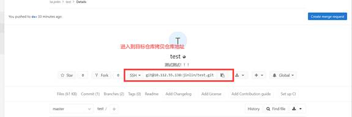


 

### 4.2在本地一个文件夹打开git bash命令行输入：

​    git clone [仓库地址]然后回车。

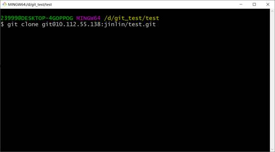

**4.3** **输入命令cd [克隆下来的文件夹名]，我这里是克隆下来是test的文件名。进入能看到命令行提示符显示master分支名了。**

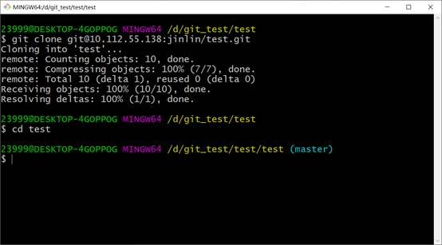

**
**

 

**4.4****输入命令git branch -a,查看所有本地分支和远程分支**

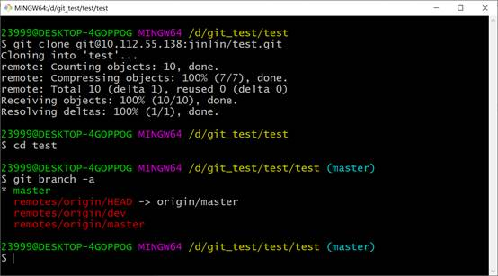

**注意我们克隆之后本地分支只有master分支，远程分支有两个分布式master和dev**

**4.5****这里我们直接输入命令git checkout dev，就会在本地建立一个dev分支并且追踪远程仓库的dev分支**

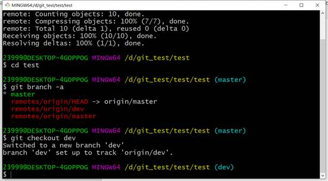

 

 

**4.6****然后我们直接在本地dev分支上新建一个本地开发，这里我以新建的本地分支为ljl，输入命令git checkout -b ljl**

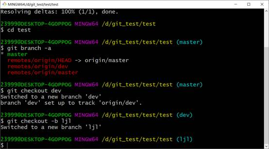

**4.7****当我们在ljl本地开发分支结束开发之后，我们先切换回dev分支，拉取远程仓库中最新的dev分支。使用到的命令为git checkout dev和git pull**

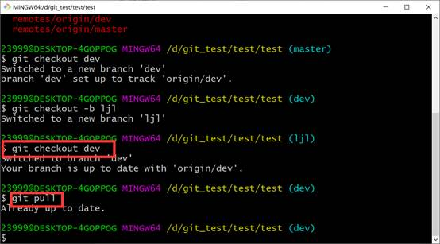

**
**

 

**4.8****切换回ljl分支对dev分支进行git merge。使用到的命令有：git checkout ljl,git merge dev**

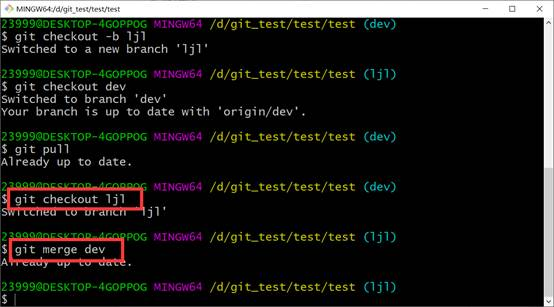

**4.9****将ljl分支push到远程仓库，由于我们的本地分支并没有和远程仓库中任意一个分支建立起分支关系，因此不能只输入git push，使用命令git push -u origin ljl.**

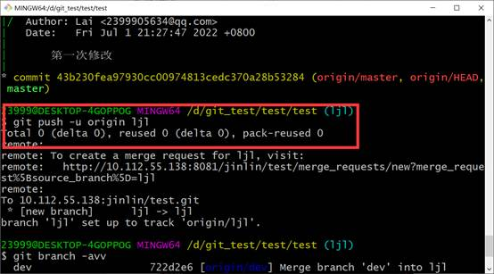

**
**

 

**4.10****进入远程仓库，可以看到我们刚刚提交的分支名了，此时我们发起merge request**

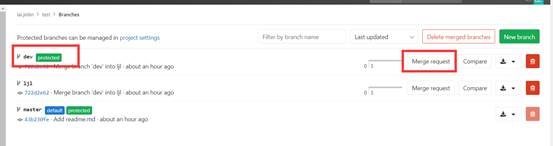

**4.11****建议merge request时勾选上删除原来的的分支**

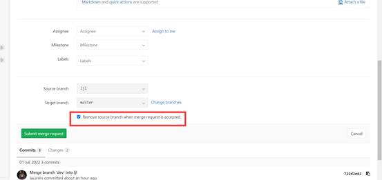

**4.12****至此，等待管理员审查代码后将其merge入dev分支中。**