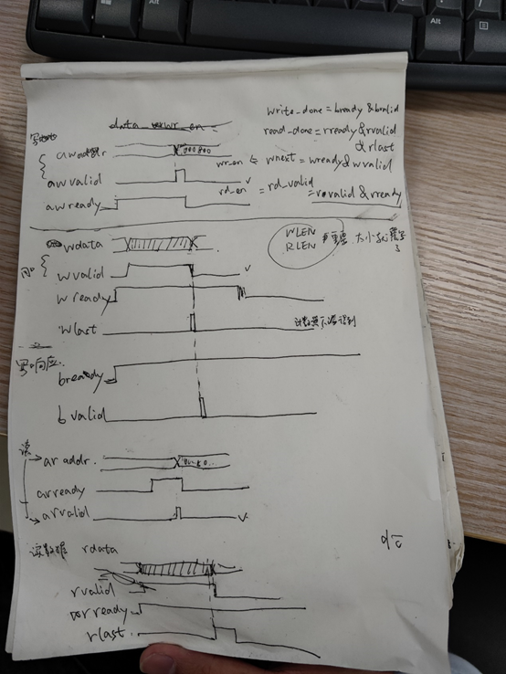
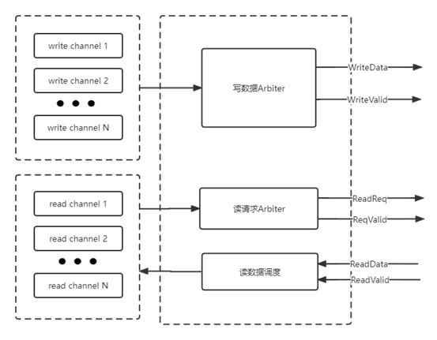
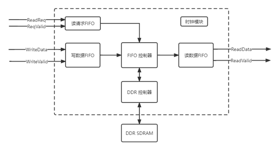
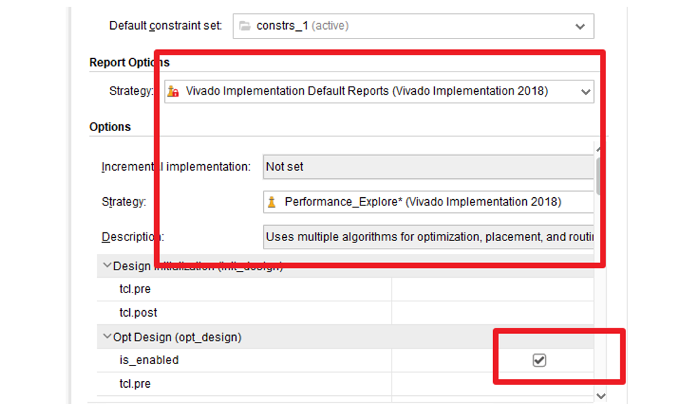

### axi4

问题：
------

#### ILA调试报错 ：

The debug hub core was not detected

\1. Make sure the clock connected to the debug hub (dbg_hub) core is a free running clock and is active.

\2. Make sure the BSCAN_SWITCH_USER_MASK device property in Vivado Hardware Manager reflects the user scan chain setting in the design and refresh the device. To determine the user scan chain setting in the design, open the implemented design and use 'get_property C_USER_SCAN_CHAIN [get_debug_cores dbg_hub].

通过更换时钟解决，但是驱动mig的时钟必须是差分管脚输入，所以需要找到板卡上其他可用时钟的管脚，对ila进行绑定

#### Invalid core MIG：

WARNING: [ Xicom 50-46] One or more detected MIG version registers have empty values: MIG properties will not be built.

MIG Invalid core解决：cpu_reset信号问题，察看kcu1500原理图发现，该复位是高1.8v，按下按钮后置0。对输入ddr的sysRst取反即可。因为擦看仿真中的sys_rst信号，发现其形状为0011000000…,故在上板时，需要对输入mig核的sys_rst取反，或者使用vio代替cpu_reset管脚进行复位。

Parameter Map Version: 1. Error Map Version: 0, Calibration Map Version: 0, Warning Map Version: 0

#### 管脚出错：

example板子选择问题，在setting中选择board

生成的MIG IP中的xdc文件与自己的xdc文件的关系：example选择board后可以不添加管脚约束，因为ip文件中有管脚约束

#### 总结：

若需要进行比特流写入，需要1、对接入MIG例化模块的sys_rst取反2、顶层例化vio，或取消相应的output，如calib和error compare定义为wire，使用ddr4_clk 3、顶层例化ila，并从额外的端口引入active and running clk，因为驱动mig的差分IO时钟只能用于驱动MIG必须是干净的不能再用来驱动ila了，使用差分buffer转buffer原语将板卡的另一组差分IO时钟转换成普通时钟驱动ila。

代码调试
--------

一般burst size与数据总线位宽一致

Cmd写命令只需拉高一次将写控制信息读入即可。控制信息在一次cmd拉高的过程中读入。

问题：时钟问题，一开始发现写不进数据，使能拉不高，后发现mig的控制时钟是300M，将其降低到100M，

上述问题变成读不出数据，读出的数据和读入不一致，且写进去的数据也和预期的不一致。通过重新把时钟设为300M，因为在例化mig的ip核时候已经选定了工作时钟。

注意更改代码后片选信号问题。

### Fifo

更改FIFO性质，使其first out，

Fifo数据使能和valid：对fifo来说，写使能拉高的同时写入的数据有效，读使能拉高的下一个cycle，读数据有效。

首先将fifo设为standard fifo，并关闭输出寄存器使其read latency 为1，所以需要将FIFO的数据写入axi的使能进行延迟：从而使得写FIFO的读出的第一个数据恰好与axi_wvalid对齐，fifo的读en的下个cycle数据有效。Wrfifo_rden通过计数器来控制，其值由数据wr-len决定。关于读，读fifo的写使能与axi的rdata对齐，读fifo的读使能rdfifo-rden拉高时，读出的数据相对使能延迟一个cycle，其拉高的cycle数为（len+1）*8，因为1个512为数据表示8个64位数据，len=0表示一个512位数据。（上面cnt1与rdrifo-rden信号也应该分开在不同的always块里进行控制）

因为在传输数据时，需要传递数据长度，地址，id号，请求，64位的数据又因为，写FIFO的读端口是512位，故使用512位宽的信号足够来传输上述各指令。但在读通道，还是需要将读控制与返回的数据分开。写fifo通道可用状态机来控制，fifo为空的状态，从首位读取命令的状态，将数据送给axi-ddr总线的状态（该状态受data-wr-en控制），初始状态，

因为前面更改了data-wr-en的控制，改为了generat-data，所以在写时应该保证前面的数据写完了（write-done）再发命令送数据（且可以通过写fifo通道将命令插在数据帧头），关于读，就可以一直发请求（两个相邻的读请求之间至少间隔5个cyle，因为请求转化为cmd命令1个cycle，generat-data缓存了3个cycle，故需要等5个cycle错误 ）不能短时间一直发读请求，需要等arready，再发请求（一般每发一次包含地址长度等的读请求，mig接受后axi-arready会由高置地，要等10个cycle左右再置高），把一系列读请求发出去后，等着数据出来即可。

 调试：由于64位端口和512位端口时钟都是300M，出现读数据一个一个读的情况。因为需要等待存完8个64位的数据就直接开始读了。注意状态机的状态寄存器位宽，状态的定义，使用摩尔状态机。状态机调试成功后发现问题：axi-wready会出现在写数据时突然拉低的情况，而此时写fifo却在工作，这会造成数据写丢。如果使用axi-wready来控制fifo的读端口，由于输出有1cycle的latency，至少会导致丢一个数据，所以需要将axi-wready拉低的同时，将数据保持，不写入。

解决方法，对原FIFO增加一个状态wvalidn，加一个无输出延迟FIFO，经过分析发现一个更好的方法，不用增加状态：在发送数据状态时，wready拉低的同时拉低wrfifo-rden，并用wrfifo-rden控制fifo读使能，而使用状态机来控制wrfifo-rden0.

关于读，也将读请求中的数据按位写入rdreqFIFO，当读准备好时，再一个一个取出发给mig（也是通过一个简单的状态机控制），读出的数据则直接送给rdfifo

该mig使用4:1的比例，即mig的时钟为1200/4=300Mhz，而总线位宽选择最大为512bit即64Byte，理论最大带宽为300*64=19200MB，而输入数据的fifo输入端口为64bit，且数据的输入端口频率无法太高，假设为150M，若要使ddr的利用率足够高，需要例化16个fifo同时给数据，然后分别通过mig一个一个写入ddr。且以上将数据地址等信息加在数据帧头的方式更有利于该多fifo分别给数据的功能实现，写一个多fifo控制，控制数据读取优先级。

### 多fifo的仲裁机制

由于通道数量的不确定性，需要使用参数化配置，并且用generate进行代码生成   

以4通道为例子构建arbiter，使用轮询机制，并将请求数参数化。

对于第i个写fifo通道，当写使能每次从开启到关闭，说明该通道完成了一段数据帧的缓存，cnt-wrframe加一，当cnt-wrframe大于0时，给出wr-req【i】，将next-grant拉高一个周期，arbiter根据当前的wr-req获得grant的值，当仲裁器grant【i】返回1时，将该fifo通道的一帧数据发给migwrfifo处理，（数据帧长度如何获得，一是读帧头的长度信息，二是使用计数器计算一次写使能拉高的cycle数，再除以8，但会被下一帧数据写入时的将计数器的值更新，不如使用方法一），发完该帧数据后，cnt-wrframe减一 ，更新wr-req，拉高next-grant。这个机制要求：用户端在写使能开启的写入的第一个数据一定要是数据帧头即包含地址长度等信息，这句话隐含的另一个意思是，写使能关闭后写入的数据长度要与帧头信息一致，否则会导致写入的数据错乱。至于得到grant后发多长的数据是完整一帧，还是要查看头部，再用计数器进行控制。

而对于读请求的仲裁，与写数据一致，需要注意的是，需要仲裁器保存请求到来的信息，以判断读出的数据返回给哪一个端口，保存历史grant，将next-grant延迟一个cycle作为保存fifo的写使能

出现重大bug，读最后一个值时，valid拉低了，已解决，通过对状态机增加一个状态，维持读数据状态

**读请求与读数据的处理**

发现设计bug，在req-arbite中不能用grant的上升沿来控制rd-en，因为grant不变时其不会出现上升沿。这个设计bug同样出现在了wrdata中，使用状态机控制rd-en来解决，通过修改状态机的状态及转移条件即可。

**使用了vivado原语，参数化fifo位宽。**

需要使用一个可变位宽的memory来存储被发去出的读请求的grant，以此来区分读出来的数据究竟该

对读数据而言，不用fifo缓存，也不使用计数器查看长度，直接通过axi4总线返回的read-done信号即时判断，通过组合逻辑控制多路选择器的选择变化，给各个模块的接收FIFO，这里需要使用二段式mealy型状态机进行控制，构造多路选择器，测试可行

注释与框图。

### 综合实现

出现时序违例，原因不明

通过增加写通道寄存器，解决写入时序，且失败端点从161个减少到了5个，且总tns控制在了300ps以内 

剩余的违例都来自arbiter-wrchan-s-reg，

通过使用vivado的实现配置

过以上方法，出现的违例都来自transeiver，这是测试模块，在后期不要使用，且在后期会与其他设计不在同一时钟域，故不需要考虑。这种方式综合实现的时间超过一个小时，扩大了2倍以上。