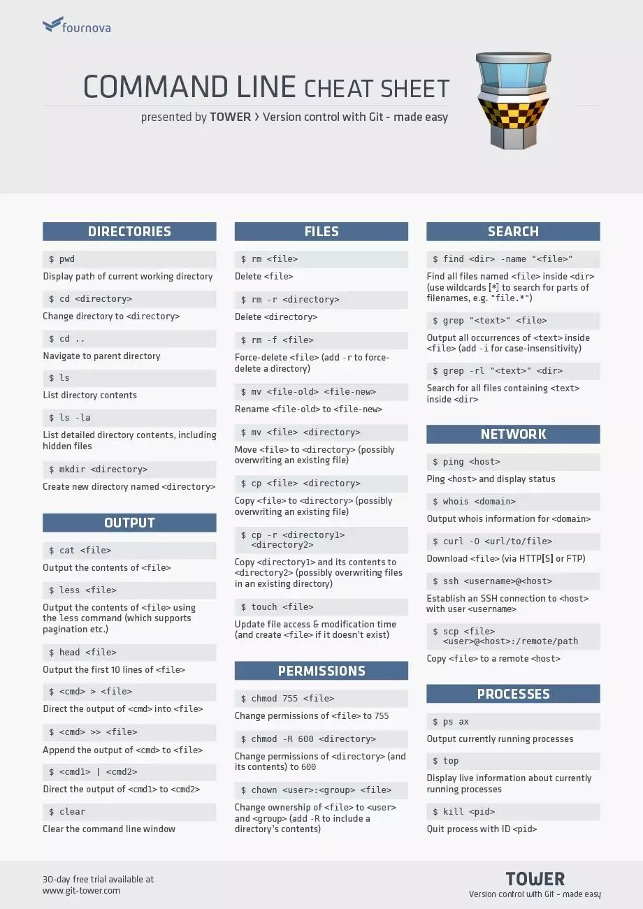

https://www.zhihu.com/question/451255512/answer/1829673241

whereis -b 

history

mans0

zip file

unzip file

压缩命令: 命令格式:tar -zcvf 压缩文件名.tar.gz 被压缩文件名 可先切换到当前目录下。压缩文件名和被压缩文件名都可加入路径...

解压缩命令: 命令格式:tar -zxvf 压缩文件名.tar.gz 解压缩后的文件只能放在当前的目录。

我们经常见到shell脚本中使用的$0,$1,$2，分别的意思就是：

1. $0:是指你所写的shell脚本本身的名字；
2. $1:是指你写的shell脚本所传入的第一个参数 ；
3. $2:是指你写的shell脚本所传入的第二个参数

命令提示符
==========

> [root@localhost ~]#

**root**：当前登录用户
**localhost**：主机名
**~**：当前所在的目录，此处为“家”目录
**#**：root超级用户的提示符，如果是普通用户，则为 **$**

命令格式
========

> 命令 [选项] [参数]

中括号 [] 表示可选

查询目录中的内容：ls
====================

> ls [选项] [文件或目录]

选项：
**-a** : 显示所有文件，包括隐藏文件
**-l** : 显示详细信息
**-d** : 查看目录属性
**-h** : 人性化显示文件大小
**-i** : 显示inode

根据以上选项，敲入命令，显示结果分别如下：

```
[root@localhost ~]# ls
anaconda-ks.cfg  test
[root@localhost ~]# ls -a
.  ..  anaconda-ks.cfg  .bash_history  .bash_logourt  .bash_profile  .bashrc  .cache  .config  .cshrc  .tcshrc  test[root@localhost ~]# ls -l
总用量 4
-rw-------. 1 root root 2752 Nov 10 02:51 anaconda-ks.cfg
drwxr-xr-x. 2 root root    6 Nov 12 19:26 test
[root@localhost ~]# ls -l anaconda-ks.cfg 
-rw-------. 1 root root 2752 Nov 10 02:51 anaconda-ks.cfg
[root@localhost ~]# ls -ld test/
drwxr-xr-x. 2 root root 6 Nov 12 19:26 test/
[root@localhost ~]# ls -lh
总用量 4.0K
-rw-------. 1 root root 2.7K Nov 10 02:51 anaconda-ks.cfg
drwxr-xr-x. 2 root root    6 Nov 12 19:26 test
[root@localhost ~]# ls -i
71259104 anaconda-ks.cfg  36099565 test
```

请注意观察 ls -l 与 ls -lh 命令的结果的区别

这里需要解释一下：

```
-rw-------. 1 root root 2.7K Nov 10 02:51 anaconda-ks.cfg
drwxr-xr-x. 2 root root    6 Nov 12 19:26 test
```

首先第一个符号 “-”（引号内的-），表示文件类型（常用的有三种，即-表示文件，d表示目录，l表示软链接文件），此外还有不常用的，为块设备文件，字符设备文件、套接字文件、管理文件。

在上述中，我们可以看到 anaconda-ks.cfg 是一个文件，而 test 是一个目录（可理解为windows的文件夹的概念）。

其次，除去第一个符号，我们来看`rw-------`，一共有九个字符，需分为三组，分别为`rw-`,`---`,`---`,每个组按照顺序分别表示**u所有者**，**g所属组**,**o其他人**的权限。在上述中，分别对应为 root，root。即第一个root表示所有者权限为root权限，第二个root表示所属组的权限也是root权限，对于其他人，则无所谓的权限可言。

其中，`r`表示可读，`w`表示可写，`x`表示执行的权限。

为了更加明白，对于 anaconda-ks.cfg 这个文件，这里列一个表格：

| 前三个字符    | 中间三个字符  | 后三个字符    |
| ------------- | ------------- | ------------- |
| rw-           | —-            | —-            |
| 所有者u的权限 | 所属组g的权限 | o其他人的权限 |
| 可读可写      | 无权限        | 无权限        |

那么，对于 test 这个文件 `rwxr-xr-x`，请读者自行判断它的权限。

在九个字符之后的点 “.”，表示ACL权限，之后的数字 1 表示引用计数，比如一个文件有一个软链接（类似windows快捷方式），那么它的引用计数就是2。

root 后面的2.7k表示文件的大小，再后面表示日期，最后是文件的名称。

目录处理命令
============

创建目录：mkdir
---------------

> mkdir -p [目录名]

**-p** : 递归创建

```
[root@localhost ~]# ls
anaconda-ks.cfg  test
[root@localhost ~]# mkdir otherFolder
[root@localhost ~]# ls
anaconda-ks.cfg  otherFolder  test
[root@localhost ~]# mkdir folder_2/test_2
mkdir: 无法创建目录"folder_2/test_2": 没有那个文件或目录
[root@localhost ~]# mkdir -p folder_2/test_2
[root@localhost ~]# ls
anaconda-ks.cfg  folder_2  otherFolder  test
[root@localhost ~]# ls folder_2/test_2
```

如上所示，mkdir 不加选项 -p 时，可以创建一个空目录，但是无法递归创建一个包含子目录的目录。加上 -p 即可递归创建。

**切换所在目录：cd**
--------------------

> cd [目录]

操作：

- **cd ~** : 进入当前用户的家目录
- **cd-**： 进入上次目录
- **cd..** : 进入上一级目录
- **cd** : 回到家目录

```
[root@localhost ~]# ls
anaconda-ks.cfg  folder_2  otherFolder  test
[root@localhost ~]# cd /folder_2/test_2
[root@localhost test_2]# cd
[root@localhost ~]# cd -
/root/folder_2/test_2
[root@localhost test_2]# cd ../../otherFolder
[root@localhost otherFolder]# cd ..
[root@localhost ~]#
```

**注意理清概念：相对路径和绝对路径**

绝对路径：从根目录一级级找下去，需要写全路径

```
[root@localhost ~]# cd folder_2/test_2
[root@localhost test_2]#
```

相对路径：参照当前所在目录进行查找

```
[root@localhost test_2]# cd ../../otherFolder
[root@localhost otherFolder]#
```

查询所在目录位置：pwd
---------------------

> pwd

可以说是最简单的命令了，查询所在目录的位置

```
[root@localhost ~]# pwd
/root
[root@localhost ~]# ls
anaconda-ks.cfg  folder_2  otherFolder  test
[root@localhost ~]# cd folder_2/
[root@localhost folder_2]# ls
test_2
[root@localhost folder_2]# cd test_2/
[root@localhost test_2]# pwd/root/folder_2/test_2
```

删除空目录：rmdir
-----------------

> rmdir [目录名]

只能删除空目录，这个命令用得比较少。

```
[root@localhost ~]# ls
anaconda-ks.cfg  folder_2  otherFolder  test
[root@localhost ~]# rmdir otherFolder
[root@localhost ~]# ls
anaconda-ks.cfg  folder_2  test
[root@localhost ~]# rmdir folder_2
rmdir: 删除 "folder_2" 失败: 目录非空
[root@localhost ~]#
```

删除文件或目录：rm
------------------

> rm -rf [文件或目录]

r 表示可以同时删除文件和目录，f表示强制删除

- 如果不添加任何选项，那么只可以删除文件，删除时提示是否确认删除
- 如果只添加选项 -r，那么可以删除文件也可以删除目录，删除时提示是否确认删除
- 如果添加了选项 -rf，那么将不做任何提示删除文件或目录

```
[root@localhost ~]# ls
abc.txt  anaconda-ks.cfg  folder_2  test
[root@localhost ~]# rm abc.txt
rm：是否删除普通空文件 "abc.txt"？y
[root@localhost ~]# rm test
rm: 无法删除"test": 是一个目录
[root@localhost ~]# rm -r test
rm：是否删除目录 "test"？y
[root@localhost ~]# ls
anaconda-ks.cfg  folder_2
[root@localhost ~]# rm -rf folder_2
[root@localhost ~]# ls
anaconda-ks.cfg
[root@localhost ~]#
```

复制命令：cp
------------

> cp [选项] [原文件或目录] [目标目录]

选项：
**-r** : 复制目录
**-p** : 同时复制文件属性
**-d** : 若源文件是链接文件，则复制链接属性
**-a** : 包含以上所有选项，相当于 -rpd

在[目标目录]后面加上文件名，就是改名复制。

```
[root@localhost ~]# ls
anaconda-ks.cfg  bbc.txt  folder_a  folder_b
[root@localhost ~]# cp bbc.txt folder_a[root@localhost ~]# ls folder_a/
bbc.txt[root@localhost ~]# cp folder_a folder_b
cp: 略过目录"folder_a"
[root@localhost ~]# cp -r folder_a folder_b
[root@localhost ~]# ls folder_b
folder_a  test_1
[root@localhost ~]# ll
总用量 4
-rw-------. 1 root root 2752 Nov 10 02:51 anaconda-ks.cfg
-rw-r--r--. 1 root root    0 Nov 13 17:21 bbc.txt
drwxr-xr-x. 2 root root   20 Nov 13 17:38 folder_a
drwxr-xr-x. 4 root root   34 Nov 13 17:39 folder_b
[root@localhost ~]# ll folder_a
总用量 0
-rw-r--r--. 1 root root 0 Nov 13 17:38 bbc.txt
[root@localhost ~]# cp -a bbc.txt folder_b
[root@localhost ~]# ll folder_b
总用量 0
-rw-r--r--. 1 root root  0 Nov 13 17:21 bbc.txt
drwxr-xr-x. 2 root root 20 Nov 13 17:39 folder_a
drwxr-xr-x. 2 root root  6 Nov 13 17:38 test_1
[root@localhost ~]#
```

这里需要解释一下的是，在原文件 bbc.txt 中，其修改时间为 17:21，在普通复制下，它的时间这个属性是不会被复制，我们可以看到复制后的bbc.txt的时间为17:38，如果需要连同属性一起复制，那么就加上 -pd 或者 直接 -a，如上所示，我们把bbc.txt复制到folder_b，这时我们查看属性的时候，时间属性和原属性是一致的。

在上述命令中，ll 是 ls -l 的简写。

剪切或改名命令：mv
------------------

> mv [原文件或目录] [目标目录]

- 如果原文件或者目录 与 目标目录在同一个目录下，那么就是重命名
- 如果不在同一个目录下，那么就是剪切

通过以下实践理解：

```
[root@localhost ~]# ls
anaconda-ks.cfg  bbc.txt
[root@localhost ~]# mv bbc.txt abc.txt
[root@localhost ~]# ls
abc.txt  anaconda-ks.cfg
[root@localhost ~]# mkdir test
[root@localhost ~]# ls
abc.txt  anaconda-ks.cfg  test
[root@localhost ~]# mv abc.txt test/
[root@localhost ~]# ls
anaconda-ks.cfg  test
[root@localhost ~]# ls test/
abc.txt
[root@localhost ~]#
```

链接命令：l cdmvcdcn
------------

> ln -s [原文件] [目标文件]

生成链接文件
**-s** : 创建软连接

**硬链接的特征**：

- 拥有相同 i 节点和存储block块，可以看做是同一个文件
- 可通过i节点识别，i节点是相同的
- 不能跨分区
- 不能针对目录使用

通过上述命令，可以理解为为某个内容添加一个标签，通过打开这个标签就可以进入这个内容，硬连接，即再生成一个标签，同样可以通过这个标签进入这个内容。

如果内容被修改，那么不管从硬链接的哪个文件进入，都是被修改的。

**软链接的特征**：

- 类似windows的快捷方式
- 软链接拥有自己的i节点和block块，但是数据块只保存原文件的文件名和I节点号，并没有实际的文件数据
- `lrwxrwxrwx` l为软链接（软链接的权限都为rwxrwxrwx，这只是软链接本身的权限）
- 修改任意文件，另一个都改变
- 删除原文件，软链接不能用（和windows的快捷方式一样）

硬链接：

```
[root@localhost ~]# ls
anaconda-ks.cfg
[root@localhost ~]# mkdir folder
[root@localhost ~]# ls
anaconda-ks.cfg  folder
[root@localhost ~]# touch bbb.txt
[root@localhost ~]# ls
anaconda-ks.cfg  bbb.txt  folder
[root@localhost ~]# ln bbb.txt folder/ccc.txt
[root@localhost ~]# ll folder/  
总用量 0
-rw-r--r--. 2 root root 0 Nov 13 18:08 ccc.txt
[root@localhost ~]# ll bbb.txt 
-rw-r--r--. 2 root root 0 Nov 13 18:08 bbb.txt
```

软链接：

```
[root@localhost ~]# mkdir folder_b
[root@localhost ~]# ln -s bbb.txt 
[root@localhost ~]# ll 
总用量 4
-rw-------. 1 root root 2752 Nov 10 02:51 anaconda-ks.cfg
-rw-r--r--. 2 root root    0 Nov 13 18:10 bbb.txt
drwxr-xr-x. 2 root root   20 Nov 13 18:09 folder
drwxr-xr-x. 2 root root   20 Nov 13 18:11 folder_b
[root@localhost ~]# ll folder_b
总用量 0
lrwxrwxrwx. 1 root root 7 Nov 13 18:11 eee.txt -> bbb.txt
[root@localhost ~]# rm -rf bbb.txt 
[root@localhost ~]# ll folder_b
总用量 0
lrwxrwxrwx. 1 root root 7 Nov 13 18:11 eee.txt -> bbb.txt
```

删除了原文件，软链接的箭头目标为红色一闪一闪，表示找不到目标文件。

常用目录作用
============

```
[root@localhost ~]# ls /
bin  boot  dev  etc  home  lib  lib64  media  mnt  opt  proc  root  run  sbin  srv  sys  temp  tmp  usr  var
```

> - / 根目录
> - /bin 命令保存目录（普通用户权限）
> - /sbin 命令保存目录（root权限）
> - /boot 启动目录，包含启动相关文件，和开机有关
> - /dev 设备文件保存目录
> - /etc 配置文件保存目录
> - /home 普通用户家目录
> - /lib 系统库保存目录
> - /mnt 系统挂载目录
> - /media 挂载目录（常用于光盘挂载）
> - /root 超级用户家目录
> - /tmp 临时目录
> - /proc 直接写入内存的
> - /sys 直接写入内存的
> - /usr 系统软件资源目录
> - /var 系统相关文档内容

命令梳理
========

在linux中，可以利用yum命令来代替“apt-get”命令，解决找不到“apt-get”命令的问题；因为linux不同发行版的软件安装工具可能是不同的，例如在CentOS中使用“apt-get”命令会显示找不到，使用yum命令代替即可。

centos安装snapd

https://blog.csdn.net/weixin_34310322/article/details/116889089

centos 安装 snapd 报错: too early for operation, device not yet seeded or device model not acknowledged

https://blog.csdn.net/u010620626/article/details/117259178

##### 有效的

sudo setenforce 0

##### 试过，但是无效的

sudo yum remove snapd
sudo yum install snapd
首先依然是使用文本编辑器进行操作，打开某一个特定用户目录下的.bashrc文件进行编辑操作，我们在.bashrc文件的内容末尾加入新的命令参数代码，具体代码如下：

#### terminal

Ctrl+e 光标移动到最末尾

Ctrl+l 相当于clear，即清屏

Ctrl+r 查找历史命令

Ctrl+Shift+n 新终端

Shift+Ctrl+C 复制
Shift+Ctrl+V 粘贴

Shift+上或下 终端上下滚动
Shift+PgUp/PgDn 终端上下翻页滚动

https://zhuanlan.zhihu.com/p/456446138

注意将apt-get 改为yum，将universal 删除

ps1通过修改命令提示符，省略冗长的路径，进而使用pwd进行路径查看

sudo yum install tree安装tree，查看目录树

window下可以使用gitBash，部分Linux命令不可用。

#### more file_name

1. **空格键**：查看下一屏；
2. **回车键**：往下滚动一行；
3. **b 键**：往前查看一屏；
4. **q 键**：退出。

#### script

#### 如何使用 script 命令？

默认情况下，直接输入 script 这个命令即可，它会在当前目录自动创建一个 `typescript` 文件，之后你在此终端的所有操作都会被记录在这个文件里。

记录文件是一个文本文件，可以使用任意的文本工具打开查看。

如果要退出记录，可以在终端里按快捷键 `ctrl + D` 或直接输入 `exit` 。在退出 script 前，你会发现，记录文件大小为 0 Kb，当退出后，文件大小会变大。

```bash
[alvin@VM_0_16_centos test]$ script
Script started, file is typescript
[alvin@VM_0_16_centos test]$ echo hello
hello
[alvin@VM_0_16_centos test]$ ls
test1.py  test2  test2.cpp  test2.py  test3  test3.c  test.py  typescript  WeixinBot  wxpy  wxRobot
[alvin@VM_0_16_centos test]$ exit
exit
Script done, file is typescript
```

如果我们想要自己起个文件名，或者将文件放在其它位置，那么我们可以直接在 script 后面跟上文件名即可。

**.bash_profile和.bashrc的区别：**

/etc/profile: 此文件为系统的每个用户设置环境信息,当用户第一次登录时,该文件被执行.并从/etc/profile.d目录的配置文件中搜集shell的设置.
/etc/bashrc: 为每一个运行bash shell的用户执行此文件.当bash shell被打开时,该文件被读取.
~/.bash_profile: 每个用户都可使用该文件输入专用于自己使用的shell信息,当用户登录时,该文件仅仅执行一次!默认情况下,他设置一些环境变量,执行用户的.bashrc文件.
~/.bashrc: 该文件包含专用于你的bash shell的bash信息,当登录时以及每次打开新的shell时,该该文件被读取.
~/.bash_logout: 当每次退出系统(退出bash shell)时,执行该文件.

另外,/etc/profile中设定的变量(全局)的可以作用于任何用户,而~/.bashrc等中设定的变量(局部)只能继承/etc/profile中的变量,他们是"父子"关系.

#### up 脚本的安装

这个脚本是第三方人员开发的，所以需要我们人为安装到我们的系统。

首先，我们需要先将 up.sh 下载到我们本地，然后再使能这个脚本：

```
$ curl --create-dirs -o ~/.config/up/up.sh https://raw.githubusercontent.com/shannonmoeller/up/master/up.sh

$ echo 'source ~/.config/up/up.sh' >> ~/.bashrc
```

之后再使用以下命令使改动生效：

```
$ source ~/.bashrc
```

#### 解决githubusercontent 443 拒绝访问问题或者github没有响应

一般我们利用curl 或者wget 获取raw.githubusercontent.com的内容时，常常会遇到443 拒绝访问的尴尬

此外在git clone等运作时会遇到没有速度的问题

### 解决方案：修改hosts文件

```bash
sudo nano /etc/hosts
```

将以下内容粘贴到文件末尾

```bash
 #199.232.28.133 raw.githubusercontent.com
 #199.232.96.133 raw.githubusercontent.com
 185.199.108.133 raw.githubusercontent.com
 185.199.109.133 raw.githubusercontent.com
 185.199.110.133 raw.githubusercontent.com
 185.199.111.133 raw.githubusercontent.com
 199.232.69.194 github.global.ssl.fastly.net
 140.82.113.4 github.com
 
```

保存[ctrl+o]，退出[ctrl+x]

刷新网络

```bash
nohup /etc/init.d/networking restart
```

#### 前后台任务管理  &，fg，bg，kill

#### 

#### 命令行图片显示imagemagick lsix（没有xterm）

### vim全屏

1.sudo yum install  wmctrl

2.修改vim配置文件，添加以下代码：/etc/vimrc 或etc/vim/vimrc 以sudo su方式进入修改配置

  let g:fullscreen = 0
   function! ToggleFullscreen()
     if g:fullscreen == 1
       let g:fullscreen = 0
       let mod = "remove"
     else
       let g:fullscreen = 1
       let mod = "add"
     endif
     call system("wmctrl -ir " . v:windowid . " -b " . mod . ",fullscreen")
   endfunction

   map <silent> <F11> :call ToggleFullscreen()<CR>

3.编辑 vimrc 文件,添加以下代码：

"Toggle Menu and Toolbar
set guioptions-=m
set guioptions-=T
map <silent> <F2> :if &guioptions =~# 'T' <Bar>
    \set guioptions-=T <Bar>
    \set guioptions-=m <bar>
  \else <Bar>
    \set guioptions+=T <Bar>
    \set guioptions+=m <Bar>
  \endif<CR>

再次启动 gvim 时,菜单栏与工具栏默认是隐藏的,这样可以充分利用窗口空间,使其显示更多的文本内容.在必要时,可使用 F2 键呼出菜单栏/工具栏；待不使用时,用 F2 键将其关闭.f11全 

**ubuntu 自动挂载media**

**查看磁盘分区的UUID**

```
sudo blkid  
```

首先运行
sudo gedit /etc/fstab

**配置开机自动挂载：**
因为mount命令会在重启服务器后失效，所以要将分区信息写到/etc/fstab文件中让它永久挂载：

```
sudo vim /etc/fstab
```

加入：

```
UUID=11263962-9715-473f-9421-0b604e895aaa /data ext4 defaults 0 1
```

[设备ID] [默认挂载点] [文件系统类型 ] [挂载选项 ] [开机检查] [系统:0 交换:1 存储:2]

**7、重启系统**

修改完/etc/fstab文件后，运行

```
sudo mount -a
```

命令验证一下配置是否正确。如果配置不正确可能会导致系统无法正常启动。