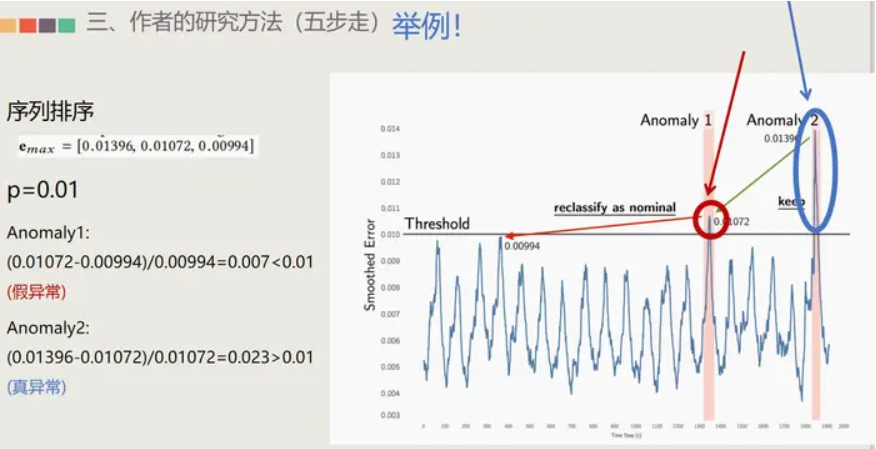

### Nonparametric Dynamic Thresholding

非参数动态阈值

- 第一步：用LSTM学习时序数据做预测
    1. 单通道模型
    2. 预测通道的值
- 第二步：收集每一步误差构成误差向量
- 第三步：对误差作加权平均的平滑处理
- 第四步：根据平滑后的数据计算阈值
- 第五步：高于阈值标为样本
- 为降低误报率，找出假阳性数据，提出“修剪策略”
- 实验参数设置及实验结果分析