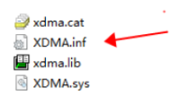
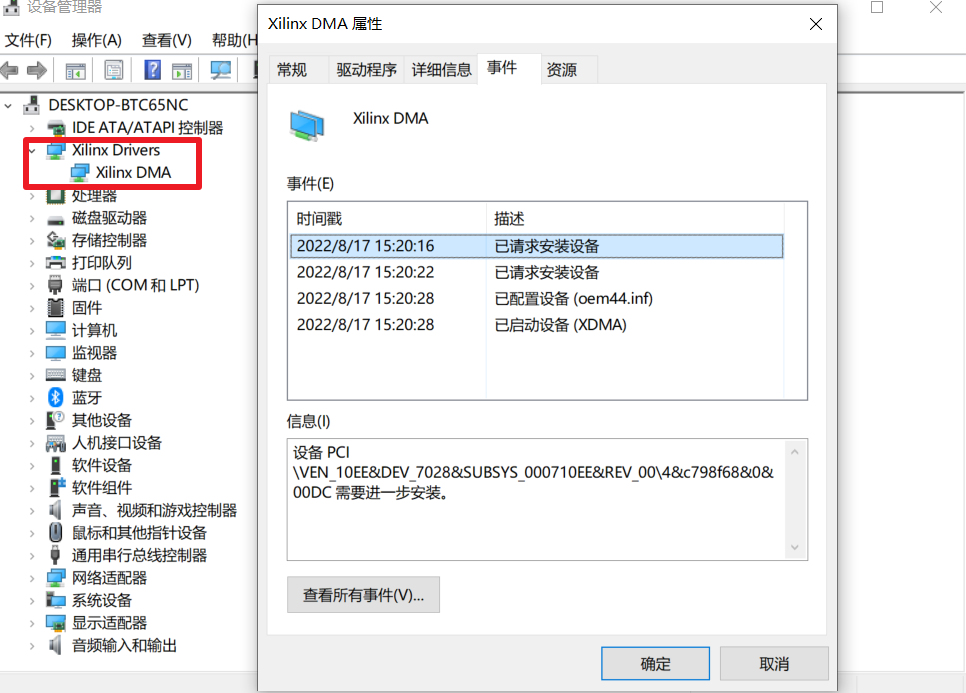
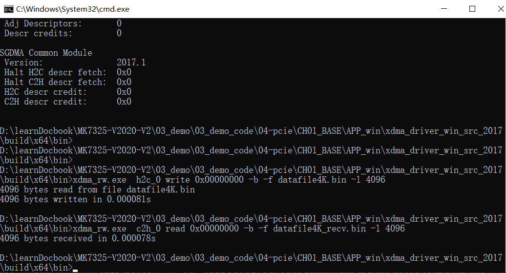
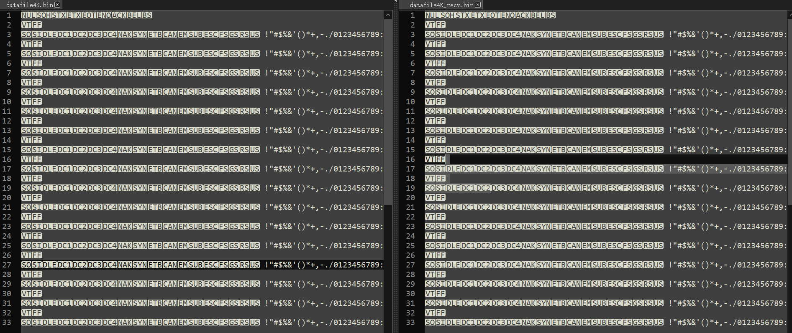
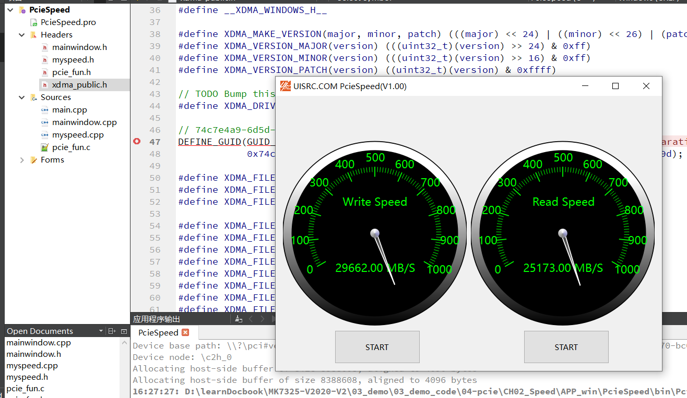

linux安装XDMAhttps://zhuanlan.zhihu.com/p/483896215

xdma的简单使用http://xilinx.eetrend.com/content/2021/100113259.html

基于Xilinx FPGA 的PCIE开发教程（1）https://zhuanlan.zhihu.com/p/493072708

pcie xdma实例5 https://www.cnblogs.com/yuzeren48/p/13755651.html

pcie xdma ddr读写https://copyfuture.com/blogs-details/20211201195633646k

Block Design的方式，适用于快速构建比较复杂的设计，例如包含DDR4，Datamover等各种基于AXI互联的IP。

在win下使用pcie，xdma，首先将mcs或bin加载到QSPI Flash，因为Pcie需要电脑关机重启来识别设备，所以需要固化程序保证断电不丢失。并且需要吧windows的快速启动关闭让其扫描pcie设备。对于windows的xdma驱动安装，使用管理员权限开启powershell，输入bcdedit /set testsigning on再重启电脑开启测试模式，再安装证书和驱动，并使用预编译的例程进行测试，但是在linux系统下，需要编译。

### pcie

驱动安装

驱动功能测试

xdma_rw.exe  h2c_0 write 0x00000000 -b -f datafile4K.bin -l 4096

xdma_rw.exe  c2h_0 read 0x00000000 -b -f datafile4K_recv.bin -l 4096

写入的数据与读出的数据一致，xdma工作正常。

### win10下xdma速度测试

如果在头文件中声明变量，然后在不同的源文件中都调用该头文件，会导致编译器报错，说变量被重复定义，（即使写了#ifndef xxxxx也不行）。
解决的方法是在对应的.c文件中声明该变量，在头文件中extern该变量。
在example.c中
int a = 0;
在example.h中
extern int a;

Qt调用头文件setupapi.h的函数SetupDiGetClassDevs()编译出错，关联了Windows API调用头文件#include <windows.h>和#include <setupapi.h>，但是编译时仍然出错。后来在一个群里，终于找到了解决方案，出现这个错误的原因是因为没有关联系统库，所以解决办法是关联setupapi的系统库就行。即seupAPI.Lib

