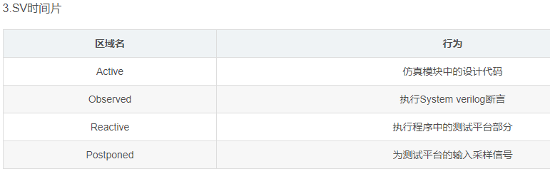

```verilog
clocking bus @(posedge clock1);		//定义clocking块bus，由clock1的上升沿来驱动和采样
		default input #10ns  output #2ns  //默认，在时钟块的所有信号在clock1上升沿前10ns对其进行输入采样，后2ns进行输出驱动
		input  data, ready, enable;
		output  negedge  ack;		//下降沿驱动，时间也没了
		input  #1step  addr;		//clock1上升沿前的1step，即保证采样到的数据是上一个时钟周期的数据
endclocking

```

