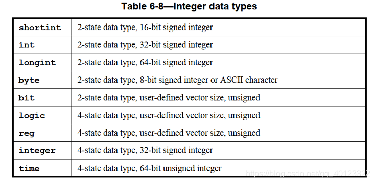
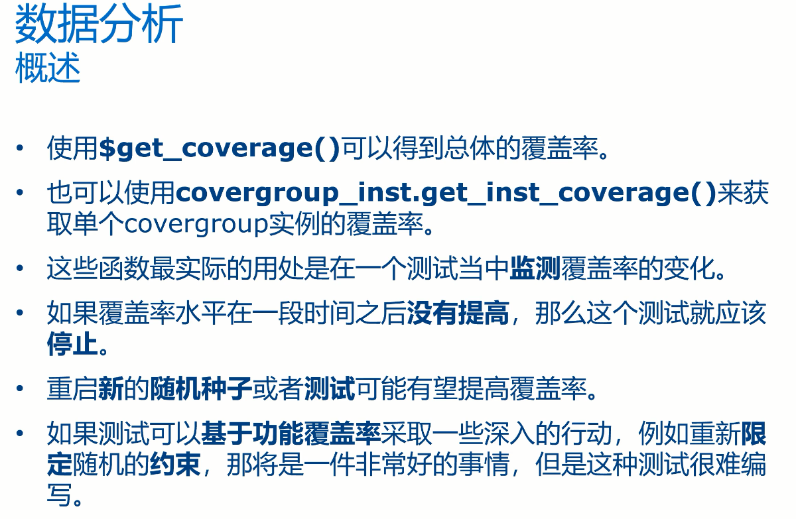

SystemVerilog functional coverage 学习

前言
-----------------------------------------------------------------

基于《IEEE Standard for SystemVerilog — Unified Hardware Design, Specification, and Verification Language》19章的学习和自己的理解。有不对的地方希望大家补充。 编译工具 Cadence的Xcelium， coverage收集工具是IMc

Overview
-----------------------------------------------------------------------

标准上对Func\_coverage的定义是：  
Functional coverage is a user-defined metric that measures how much of the design specification, as enumerated by features in the test plan, has been exercised.  
个人理解：  
衡量验证激励完备性及场景完备性的一个标准，Functional\_coverage可以检查  
1\. 你关心的场景是否覆盖  
2\. 构造的随机激励的随机程度  
3\. 对应的feature点是否有覆盖  
Functional\_coverage与code coverage不同. Code coverage 由工具自动产生， Functional coverage是验证工程师基于对DUT的认识来对验证feature进行分解后，将需要覆盖的点进行分析后写出。 因此对于DUT的认识非常重要。

Covergroup定义与收集
------------------------------------------------------------------------------

### Covergroup定义与例化

Covergroup是承载coverage的容器。 coverage只能收集integral Data types，对于real等类型的数据是不能收集， 附：integral data type。  


Covergroup只能定义在**package/class/module/program/checker/interface**中。  
方式有两种：  
1\. 常规方式;

```
	covergroup demo_cg;  ... endgroup
	demo_cg test_cg_inst = new;

```

这种方式可以例化多份，但注意covergroup 不能例化为数组（此方式只又有Xcelium不支持）

```
	demo_cg test_cg_inst[4];  		//Error: Arrays of covergroup instances are not supported.
	demo_cg a_inst, b_inst; a_inst = new; b_inst = new; 	// OK

```

2.  Class中, 支持embedding covergroup 可以简洁的方式快速采集Class中的变量

```
	Class A；
		covergroup demo_cg; ... endgroup
		demo_cg = new;
	endclass

```

Covergroup可以传入参数，端口类型的话只可以的input/ref， Output与inout是不支持的。定义为input的变量在例化时便定义好了，后面该变量变化，Covergroup内的值不会随着变化，如果需要采集变化的变量，需要定义为ref类型。

```
class test；
	int port_a，port_b;
	 covergroup demo_cg(ref int cnt, input int mid) @(posedge clk);
	    counter_cg: coverpoint cnt{
	      bins part1[] = {[0:mid]};
	      bins part2[] = {[mid+1:10]};}
  	 endgroup
  	 port_b = 5;
  	 demo_cg = new(port_a, port_b);  //这里demo_cg， mid为5
  	 ....
  	 port_a =1;  
	@(posdge clk); //sample， port_a=1
	port_a =2;
	port_b =4;  //mid不在变化
	@(posdge clk); //sample， port_a=2
	...
endclass

```


_NOTICE: 如果使用Xcelium作为编译工具：covergroup只能定义在uvm\_component中，不能定义在uvm\_object中， 否则无法采集(IMc 上看不到该coverage)，貌似是工具bug, VCS并没有这种问题。_

### Coverage的sample

采集coverage的方式有很多，可以使用自带的sample函数，也可以使用 @来指定。

1.  Sample的方式  
    sample是Covergroup自带函数，可以调用sample来指定的采样时刻，Sample可以被override， 传入参数,传入的参数可以作为采集的一部分。

```
Class test;
	logic[3:0] port_a;
	covergroup demo_cg with function sample(bit[3:0] i);
		coverpoint i;
	endgroup
	...
	port_a = 1;
	demo_cg.sample(port_a);
endclass

```

但注意 Sample传入的参数只能作为coverpoint、cross中需要采集的一部分， 其他的使用方式会报错:

```
	covergroup demo_cg with function sample(boolean a, int b, int c);
		coverpoint c;
		option.per_instance = a;  //Error
		option.wegiht  = b; 	//Error
	endgroup

```

2.  使用clocking event进行触发， @(expression), 这里的expression通常为 event，posedge clk, singal等，在这里expression值发生变化便会触发采样（如果是@(singal), signal的值发生变化及采样）。

```
int port_a;
covergroup demo1_cg@(port_a == 1); endgroup
covergroup demo2_cg@(port_a， iff port_a == 1 ); endgroup
...
@(posedge clk); port_a = 1; //（port_a == 1）0->1， port_a 0->1, demo1_cg, demo2_cg都发生采样
@(posedge clk); port_a = 1; // (port_a == 1) 1->1无变化 port_a 1->1变化, demo1_cg, demo2_cg都不采样
@(posedge clk); port_a = 0; //（port_a == 1) 1->0发生变化， demo1_cg发生变化， port_a != 1 , demo2_cg 不采样

```

因此注意实际采样时，不要用这中条件表达式的形式来进行采样， 得到的结果往往超出你的预期。  
绿皮书中有采用 assert\_porperty的方式进行采样，这里省略。  
**推荐采用指定event的方式，或者直接调用sample函数，这样清晰明确。**

Coverpoint
-------------------------------------------------------------------------

### Coverpoint的定义

Coverpoint定义了Covergroup具体需要cover的点，这个coverpoint的点可以是变量，或者变量的表达式，但数据类型注意依然必须是integral data types。另外coverpoint收集的变量需要在定义coverpoint前声明。run  
定义方式：

```
real tim;
covergroup demo_cg;
	coverpoint a;  			//方式1，不指定coverpoint的label
	b_cp: coverpoint b; 	//方式2, 指定label
	cb_cp: coverpoint c+b;
	tim_cp: coverpoint tim; // Error，不可以是non-integral data type
	d_cp: coverpoint d;    // Error, 应先定义 int d；
endgroup
.....
int d;

```

定义的两种方式， 指定label和不指定label，不指定label的话，系统自动将变量名作为label. 推荐指定label，加入\_cp表明是coverpoint 清晰明了。  
标准中可以在coverpoint前定义数据类型，该coverpoint中的变量的数据类型会被强制转换成定义的数据类型。但Xcelium不支持，VCS可以尝试一下。

#### Bins for values

Coverpoint中使用bins来收集每个coverpoint的变量具体值.  
bins可以用户自己指定，也可以系统自动产生。  
当用户自定义bins后，不在用户自定义的bins的范围内数值被自动归为default bins，default bins的值将不会建仓，default bins通常由系统自动产生，用户也可以自定义。bins可以cover 一个值/多个值，bins还可以指定为数组。  
如果bins\[fixed\_number\] = {x,y,…,z}; 如果fixed\_number < {}中的数量，则每个子bins中的数量是他们的整除， 如果有余数，则放入最后一个bins中。  
在bins中也可以使用iff(expression), 来限定采集的条件

```verilog
bit[3：0] a，b,c ;
covergroup demo_cg（input bit[3:0] mid）;
	coverpoint a {
		bins zero 		= {0};
		bins mult		= {0,[2:3]}; //当a为 0/2/3便可以cover该bins
		bins test1[13]  = {[1:10],1,4,7};  //test1被分为10个子bins，分别为<1> ... <10> <1> <4> <7>
		bins test2[20]  = {[1:10],1,4,7};  //test2虽然定义了20个子bins，但实际上被分成了13个子bins，<1> ...<10> <1> <4> <7>
		bins test3[4]   = {[1:10],1,4,7};  //test3分成了4个子bins，<1,2,3>, <4,5,6>, <7,8,9>, <10,1,4,7>，这里是个trick
		bins test4[]    = {[1:10],1,4,7};  //test4被自动分成了10个子bins，<1> ... <10>, 重复的被merge在一起了
		//这里default_bins 为<11> ...<15>，这些便不再建仓
	}
	coverpoint b {
		bins sml[] = {[1：8]} iff(c==1);  //在c==1时，才开始收集
		bins big[] = default; 	//其他的<0>,<9>...<15>
	}
	c_cp: coverpoint c {
		bins sml[] = {[0:mid]};  //mid的值在covergroup new的时候给出来。
	}
endgroup
...
demo_cg = new(5); //指定mid=5


```

IEEE SystemVerilog-2012 中新增特性：

1.  **with(with\_cover\_expression)** 可以指定expression，对满足expression的值进行建仓，通过expression来构造出复杂的建仓场景，with\_cover\_expression中关键字item表示candidate value（不好翻译），用例子来表示：

```
coverpoint a {
	bins test6[] = {[1:10]} with（item%3 == 0); //只对1~10范围内满足%3==0的数进行建仓，<3>,<6>,<9>
	bins test7[] = {[1:10]} with (myfunc(item)); //只对1~10范围内满足myfunc的值进行建仓
}

```

2.  可以支持对自定义的数组进行建仓，这种常用再onehot、复杂算法场景中。  
    eg： select信号为onehot信号，cover在select信号所有有效的场景情况下，读写都有发生过。

```
logic[5:0] encoding[6] ;
logic[5:0] select;
logic	   rw; 
covergroup onehot_rw_cg;
	SEL： covergroup select{
		bins onehot[6] = encoding;  //这里onehot的每个子bins中都是有效的场景<6'b1><6'b10><6'b100> ... <6'b10_0000>
	}
	RW: coverpoint rw{
		bins WR = {1};
		bins RD = {0};
	}
	sel_rw_crs: cross SEL, RW; 
endgroup
foreach(encoding[i]) encoding[i] = 1<<i;  //encoding构造onehot数组 //需要在covergroup new之前定义好数组场景
onhot_rw_cg = new;

```

参考： [Dave大佬关于SV 2012 新特性的介绍](https://blogs.sw.siemens.com/verificationhorizons/2013/02/07/ready-for-systemverilog-2012/)

### bins for sequence

coverpoint还可以收集变量的变化场景。直接上例子

```
Coverpoint a {
	bins test1 		= (1=>2=>3）;  		//收集变量a 从1变化到2再变化到3的场景
	bins test2 		= (1=>2), (2=>3); 	//收集变量a 从1变化到2或者2变化到3的场景
	bins test3 		= (1,2=>6,7);  		//表示收集1=>6/2=>6/1=>7/2=>7 四种场景之一
	bins test4[] 	= (1,2=>6,7);  		//表示收集1=>6,2=>6,1=>7,2=>7 四种场景
	bins test5      = (1=>[*3]2=>3); 	//收集1=>2=>2=>2=>3
	bins test6      = (1=>[*3:5]2); 	//收集1=>3~5个2
	bins test7      = (1[->3]);			//收集...=>1...=>1...=>1 （...）表示任意数量的除1之外的任何值
	bins test8      = (1[=3]) ;         //收集...=>1...=>1...=>1 （...）表示任意数量的除1之外的任何值, 这个要求最后一个1结束后不会再出现任意1
	bins test9      = (1=>2[->3]=>3);   //收集 1...=>2...=>2...=>2=>3 
	bins test10     = (1=>2[->3]=>3);   //收集 1...=>2...=>2...=>2...=>3  
}

```

除了bins还有 illegal\_bins和ignore\_bins。illegal\_bins 表示当采集的值再illegal\_bins内，属于非法值报错，ignore\_bins为不采集某些值。  
优先级为： illegal\_bins > ignore\_bins> bins

```
coverpoint a {
	illegal_bins zero0 = {0};
	ignore_bins  zero1 = {0};
	bins         zero2 = {0};
	bins		 one  = {1};
}
结果： 当a=0时， 首先报错，然后在工具上不能看到bins zero2（被ignore掉）只能看到one

```

### Coverpoint自动划分bins

如果没有指定bins，那么coverpoint会自动划分N个bins，规则是：  
1\. 对enum: N= enum定义的数量  
2\. 对与其他类型： N 根据 2^M 以及auto\_bin\_max决定, M表示多少bit可以cover 这个coverpoint。 如果N<2^M， 则2^M个取值自动分配到N个bins中，如果无法整除，则自动分配到最后一个。  
**自动建仓，只能采集2-state的值，x,z无法采集。**  
每一个自动建的仓都已auto\[value\]命名，value为这个bins中覆盖的值

### Wildcard

定义了wildcard后， x，z以及？都将被视为通配符，表示0/1.

```
wildcard bins g12[] = {4'b11??}; //表示1100，1101，1110，1111
		 bins gz[]  = {4'b11??}; //表示对1100,1101,1110,1111 建仓

```

cross
--------------------------------------------------------------------

将covergoup中的多个coverpoint进行cross，可以同时观察多个coverpoint的组合关系。corss会将所有的coverPoint进行组合，例如你有N个coverpoint，每个coverpoint有M\[i\], 则cross后所有的仓的数量为M\[0\]\*M\[1\]…\*M\[N\]  
cross与coverpoint的bins相似。但注意：

1.  cross的bins不支持数组的形式bins\[number\]/bins\[\]。
2.  coverpoint的在用户自定了bins后，不在bins范围内的值将不会建仓，cross不在bins范围内的组合会自动建仓。

### binsof

binsof(name) 指定带有表达式约束的bins，这里的name可以是一个coverpoint，或者coverpoint的bins。

```
covergroup demo_cg;
	coverpoint x[3:0];
	cross x,z {
		bins a=binsof(x) intersect{y};  //表示将满足coverpoint x的值==y的cross组合作为一个仓。
		bins b=!binsof(x) intersect{y}; //表示将满足coverpoint x的值!=y的cross组合作为一个仓。
		bins c=binsof(x) intersect{[$:y]};  //表示将满足coverpoint x的值在0~y的cross组合作为一个仓, $表示边界值
		bins c=binsof(x) intersect{[y:$]};  //表示将满足coverpoint x的值在y~15的cross组合作为一个仓, $表示边界值
	}
endgroup

```

### with

Syntax: WIth(with\_cvoergroup\_expression) \[matches integer\_covergroup\_expression\]  
与covepoint的with类似，将满足with\_covergroup\_expression的cross组合作为一个仓。  
matches用于定义with\_covergroup\_expression的最小值？？（这个地方存疑）  
Xcelium 不支持，因此没有测试。

```
covergroup demo_cg
	coverpoint a;
	coverpoint b;
	ab_crs: cross a, b {
		ignore_bins test1 = ab_crs with(a+b<3) ;	//不收集 a+b<3的cross组合
		bins test2 = binsof(a) with (a>10) && 
					 binsof(b) with (b+1==a);  //对a>10 && b+1==a的cross组合建一个仓
		bins test3 = ab_crs with(a+b<10) matches 5; //将满足5<a+b<10的cross组合建一个仓, Xcelium不支持
	}
endgroup

```

##### CrossValType与CrossQueueType

为了便与描述, Systemverilog自动将一个cross的所有coverpoint组成一个新的数据类型CrossValType，将这种数据类型的queue定义为CrossQueueType.  
  
所以就可以利用这种数据类型快速定义一些bins，还可以在使用funciton的方式在向bins传入 CrossQueueType类型的queue，这种方式常用来产生多个illegal\_bins和ignore\_bins， 但注意CrossQueueType的作用域只在Cross中

```
ab_crs：cross a,b{
	bins test1 = '{'{1,1},'{2,2}}; //将a=1&&b=1或者a=2&&b=2的cross组合进行建仓
	function CrossQueueType myfunc;  //这里的func的类型是CrossQueueType
		for(int x=0; x<16; x++)
			myfunc.push_back('{x,x+1});
	endfunction
	ignore_bins test2 = myfunc;  //将满足b=a+1的且a的范围在0~16的cross组合作为ignroebins
}

```

Cross中bins/ignore\_bins/illegal\_bins的顺序与coverpoint一致：  
illegal\_bins> ignore\_bins> bins

### Cross sequence

IEEE SV上给出的Cross的是coverpoint for values， 没有cross coverpoint for sequence的。没有在standard中看到明确有写不可以cross sequence的，（也许不够仔细，有大佬看到了麻烦告知一下，）。 大家或许也有需求去cross sequence，Mentor Support上看到大佬都是建议：  
定义一个新的枚举类型，将cross sequence需要关心的场景变化，转换成这个枚举类型的变化。然后变成coverpoint for sequence。这里直接搬运链接：  
https://verificationacademy.com/forums/systemverilog/cross-coverage-transition-bins-each-bin-containing-more-1-value-it.#reply-46693

Options与Predefined coverage methods
--------------------------------------------------------------------------------------------------

Covergroup有一些选项，里列出了几种常见的类型  
  
type\_option与option  
type\_option指定后，会影响该covergroup例化的所有instance  
option，只影响该例化的covergroup

这里详细可以参考：https://blog.csdn.net/seabeam/article/details/46369995

这些是Predefined methods，这里常用的只是sample，其余的methods暂时没有用过  


个人体会
-------------------------------------------------------------------

短暂的工作经验也有一些感悟。列在这里，有不同想法的大家可以评论/私信我呀，一起进步。

1.  func\_coverage一定要保证你收集的数据是你期望收集到的，而不会收集无效的数据，而把一些真正没有cover到的东西漏掉，举个例子：apb的flit收集，vip会在psel信号没有拉起来时，随机addr和wdata，如果你没有判断psel==1，便收集，那一定会收集到很多无效的东西。如何保证收集到的是期望的东西：  
    a. 推荐采用调用sample函数的方式或者明确的event的形式，这样条件明确，你清晰的知道自己该在什么时候收集  
    b. 对于正常功能feature的func\_coverage，一定要在经过正确的比对后才收集，异常的激励单独收集。
    
2.  命名的要清晰，这个绿皮书中也提到了，明确你要收集的是什么，不一定要简介，一定要写清楚你想收集的是啥，covergroup加\_cg后缀，coverpoint加\_cp后缀，cross加\_crs后缀，这样比较友好，检视时也很方便。
  
3.  coverpoint， cross，可以利用sv\_2012的新增功能写出非常复杂的但又异常简洁的代码，但这个真的非常不友好，也许你今天写完明天就忘记了，检视时也会一头雾水，所以尽量简单易懂就好，宁可多写几行。


Covergoup实际应用举例
------------------------------------------------------------------------------

自己还是个小白的时候最愁的事就是看完绿皮书后，道理我都懂，但我就是不知道该怎么用，尤其框架/模板是啥样子的。网上也很少，所以这里给自己挖个坑。将自己用到的模板列在这里。也是自己的回顾吧。

看到最后点个赞呀，写了文章才体会到被点赞的快感。

 

  
