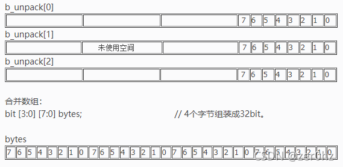
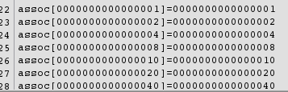
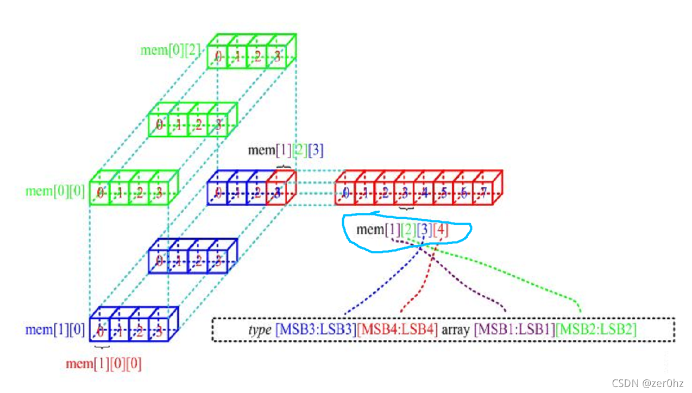
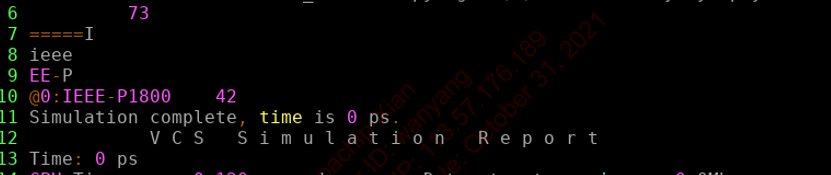
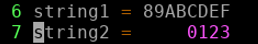

#### 文章目录

- logic
- bit
- 数组
- - 数组的定义
    - - 定宽数组
        - 多维数组
        - 合并数组
        - 常量数组
        - 动态数组
        - 关联数组
    - 数组操作
    - - 数组缩减方法
        - 数组随机选择一个元素
        - 数组的定位
- 队列定义和使用
- 结构体
- - 结构体的定义
    - 非压缩结构体和压缩结构体
- 联合体
- 枚举类型
- 字符串

verilog中的数据变量可以映射到实际的硬件中的线网和变量，而systemverilog由于主打对DUT的验证，所以我们要有一些软件的思想在里面，就添加了一些新的变量能够软件和硬件相互联系，并且能够更好在用软件的思想去编写。

| Type      | 2-4 states | signed/unsigned | size | SV/V |
| --------- | ---------- | --------------- | ---- | ---- |
| shortint  | 2          | signed          | 16   | SV   |
| int       | 2          | signed          | 32   | SV   |
| longint   | 2          | signed          | 64   | SV   |
| byte      | 2          | signed          | 8    | SV   |
| bit       | 2          | unsigned        |      | SV   |
| logic     | 4          | unsigned        |      | SV   |
| reg       | 4          | unsigned        |      | V    |
| net       | 4          | unsigned        |      | V    |
| integer   | 4          | signed          | 32   | V    |
| real      |            |                 |      | V    |
| shortreal |            |                 |      | SV   |
| realtime  |            |                 |      | V    |
| time      | 4          | unsigned        | 64   | v    |

# logic

logic：在verilog中会有wire和reg，倾向于设计人员懂得所描述的电流哪些变量应该被实现为寄存器，哪些变量应该被实现为线网；sv中侧重于验证，不关心logic对应的逻辑是寄存器还是线网。**logic在多个驱动时会报错，虽然可以把信号声明为logic，但是在inout端口时，需要将port声明为wire**


```
module logic_data_type(input logic rst_);
	parameter CYCLE = 20;
	logic q,q_l,d,clk,rst_l;
	intial begin
		clk = 0;
		forever # (CYCLE/2) clk = ~ clk'
	end

	assign rst_l = ~rst_h;
	not nl(q_l,q)
endmodule
	)
```

**这里有一种方便的赋值方式**


```
'1:logic[111111:0]sig
sig = 111112'b1111111....111;
sig = '1//这里可以直接将里面所有的都赋值为1 
```

# bit

- 都是无符号的类型
- 与logic不同之处：二值逻辑


```
logic [7:0] logic_vector = 8'b1000_0000;//128
bit [7:0] bit_vector = 8'b1000_0000;//128
byte signed_vector = 8'b1000_0000; //-128
```

解释：是一个有符号数，如果是8位的有符号数，他只能够表示：模的概念，8位二进制数的模是256，有符号的整数范围表示-128～127，负数=模-｜负数｜，也就是说用128表示-128，128是正数，原码和补码一样，所以-128的补码就是1000_0000，则当对byte sign_vector=1000_0000进行赋值时，认为他是补码，首先先-1，再取反才是原码，所以实际上sign_vector也就是原码是1000_000，表示-128。
**注意一般我们都使用无符号的bit31:031:0这样进行定义数组，这样能够减少某些数的使用出错**
对不同数据类型进行操作时需要注意:

- 逻辑数据类型
- 符号类型
- 矢量位宽
    如果logic类型和bit位宽不同，但是进行了运算时：


```
logic [3:0] x_vector = 4'b111x;
bit [2:0] bit_vector;
initial begin
  $display("@1 x_vector  = 'b%b",x_vector);//'b111x
  bit_vector = x_vector;
  $display("@2 bit_vector  = 'b%b",bit_vector);//'b110
```

说明：

- 四值逻辑的赋值给二值逻辑，x会变成0；
- 多位赋值给少位的，高位会截断；

数组
====

## 数组的定义


### 定宽数组

Verilog里面需要定义数组的上下界，因此会从0开始定义边界，而**sv可以直接只定义范围**。例如：`int arrary[8][4];`代码如果对定宽数组中进行读取越界值，会针对不同的元素类型返回缺省值，**双状态的是0，四状态的是X，wire在没有驱动时是Z**；


```
int lo_h[0:15];//定宽数组声明
int c_style[16];//紧凑型声明
```


### 多维数组


```
int array[0:1][0:2];//声明
int array[2][3] = '{'{0,1,,2},'{3,4,5}};//把数组看成行列，012是第一行，345是第二行
```


### 合并数组

- 非合并数组：类型 数组名 【第一维位宽】【第二维位宽】…
- 合并数组：类型 【第一维位宽】【第二维位宽】…数组名
- 从定义上看不同之处在于维度宽度定义放的位置。
- 从内存存放来看：合并数组可以把数据当成一个整体来访问，也可以把它们分解成更小的单元。
    


```
 //合并型数组
 bit [3] [7:0] b_pack  
 // 表示3行 x 8列的数组，[3]是高维度（高维度），[7:0]是低维度(第一维)
//非合并型数组——形式1
bit[7:0] b_unpack [3]     // [3]是高维度
 // bit 是二值逻辑，表示占据了三个word的空间，每个占据低8位空间
//非合并型数组——形式2
int a1[7:0] [1023:0] ;  // [7:0]是高纬度
```


### 常量数组

所有的数组量都被定义了，下面有声明和初始化的方法


```
int ascend[4]='{0,1,2,3};//说明数据里面的元素都是int类型。
int descend[5]='{5{8}};//
int descend='{9,default:1};
```


### 动态数组

如果程序执行之前不知道数组宽度，可以使用动态数组，但是在调用之前需要new[]指定宽度，这里要跟class定义对象区别开。


```
int dyn1[],dyn2[];
initial begin
  dyn1 = new[5];//分配5个元素
  foreach(dyn1[j])//数组初始化
    dyn1[j] = j;
  dyn2 = dyn1;//复制整个数组给dyn2
  dyn2[0] = 5;//更改其中一个元素
  dyn1 = new[20](dyn1);//分配了20个元素，然后把原来的5个数也复制给新的数组
  dyn1 = new[100];//分配100个元素，旧值不存在
  dyn1.delete();//所有元素被删除
  end
```


### 关联数组

关联数组由于保存稀疏矩阵的元素，如果对一个非常大的地址空间进行寻址时，sv只为实际写入的元素分配空间。
声明方式：int*in**t*等在方括号中放置数据类型的形式，如果使用for循环去寻址是无法进行寻到的，需要foreach循环去遍历数组，然后使用do…while能够找到索引值参数的值，然后可以根据数组是否为空返回0/1；


```
initial begin
bit [63:0] assoc[bit[63:0]],idx=1;
//对稀疏分布的元素进行初始化
repeat(64)begin
	assoc[idx]=idx;//
	idx=idx<<1;//不断增加位数，然后变为1、2、4、8、16
	end
foreach(assoc[i])
	$display("assoc[%h]=%h",i,assoc[i]);
	end
	//function transver array
	if(assoc.first(idx))
		begin
		do
		$display("assoc[%h]=%h",idx.assoc[idx]);
		while(assoc.next(idx)));
		end
		//find and delete first.elememt
		assoc.first(idx);
		assoc.delete(idx)
```

仿真结果：


数组操作
--------

1. 数组操作返回数组宽度**$size**
2. for/foreach，需要注意foreach里面的操作的有效性。


```
for (int i=0;i<$size(src);i++)
foreach(dst[j])//相对较为简单不需要重新定义j，但是这个j是有寿命的
	dst[j]=src[j]*2;
	$display(j);//会报错，因为j在foreach后就已经不存在了，如果要继续使用
	initial begin
	foreach (dst[j])
	...
	$display(j)
	end
```

对于多维数组使用foreach的操作是**foreach (mdi,j*i*,*j*)**注意这里是在一个方括号里面使用逗号隔。


```
int md[2][3]='{'{0,1,2},'{3,4,5}};//初始化多维数组的方法，然后可以把它想象成两行三列的数据；
foreach(md[i,j]);
	$display("md[0%d][0%d]=%0d",i,j,md[i][j]);
```

- 定宽数组和非定宽数组的结合
    多维数组访问顺序：int1:01:02:02:0mem0:30:30:40:4,这里**先访问mem右边的左往右，再访问mem左边的左往右**；
- 复制和比较：sv中数组能够使用==直接对数组进行是否相同进行比较，但是前提是能够是相同宽度的数组进行比较。


```
if(dsc==src)
	$display("dsc==src");
	dsc=src;//直接将所有元素都复制给dst；
```


### 数组缩减方法


```
bit [10];
initial begin
foreach(on[i])
	on[i]=i;
	$display("on=%p",on);//‘h0,'h1,'h0,'h1,'h0,'h1...共10个
	$display("on.sum=%d",on.sum)//得到1'b1;
	$display("on.sum=%d",on.sum+32'd0)//得到1
	$display("the and is %d ",on.and());//0,进行的是与操作，有0就为0；
    $display("the or is %d ",on.or() );//1，或有1就为1；
    $display("the xor is %d ",on.xor());//1，异或，相异得到1；
    $display("the product is %d ",on.product());//0,积，把其中每个数都进行相乘。
```


### 数组随机选择一个元素

定宽数组、队列、动态数组和关联数组使用 u r a n d o m r a n g e ( urandom_range( urandomrange(size(array)-1);如果是队列和动态数组还可以使用$urandom_range{array.size)-1)


```
int aa[int],rand_idx,element,count;
element=$urandom_range(aa.size()-1);
foreach(aa[i])//如果在关联数组中随机选取的一个元素，需要逐个访问它之前的所有元素，这里是将一个以整数值为索引的关联
	if(count++==element)begin
	rand_idx=i;//保存关联数组的索引；
	break;
	end	
```


### 数组的定位

使用一系列的方法，会返回队列；


```
int f[3]=’{1，4，3};
tq=f.min();
tq=f.max();
tq=f.find with (item>3);
tq=f.find_first_index with(item==8);//返回索引值
```

队列定义和使用
==============

- 队列与数组相似，可以通过索引实现对任一元素的访问，但是不像列表一样遍历元素前的所有元素。
    不要对队列进行new()使用构造函数new[]；
- 如果吧$放到一个范围表达式的左边，就表示最小值，放到右边，就表示最大值；
- 可以在添加或者是删除队列中的元素
- 如果在使用队列的时候最好先q.delete一下再使用；


```
int j = 1,q2[$] = {3,4},q[$] = {0,2,5};//初始化常量队列不需要'
initial begin
  q.insert(1,j);//在第二个元素之前插入j，{0,1，2,5}
  q.insert(4,q2[1]);//{0,1,2,3,4,5}
  q.delete(1);//{0,2,3,4,5}
  q.push_front(6);//{6,0,2,3,4,5}
  j = q.pop_back;//{6,0,2,3,4}
  q.push_back(8);//{6,0,2,3,4,8}
  q.push_front;//{0,2,3,4,8}  
```

结构体
======

结构体的定义
------------

- **为什么要用结构体**：因为Verilog缺少一些复杂的数据结构，为了后面更好地进行处理数据，添加了能将数据变量进行结合地结构体（struct），**但是不能够是线网类型**； 许多组织在一起的数据项组成，类似“书名、作者、版次”结合在一起
- 用法：可以使用typedef来进行自定义，如果不适用typedef也可以，但是会比较麻烦；
- 结构体类型一个模型，系统不分配内存，只有响应的变量后才有内存；
- 结构体可以进行嵌套；
- 不能够将结构体作为一个整体进行输出；
- 需要一级一级的进行嵌套的输出，类似：struct a.b1.c1.d1 ；

typedef和define的区别：

- typedef在编译阶段进行处理，然后进行语法检查；
- define不会进行语法检查，只是一个文本替换的作用；


```
`define OPSIZE 8//定义宏
struct {bit[7:0]r,g,b;}pixel;//创建一个pixel结构体，这里和下面的区别是
struct{int my_i;real my_r;}
	my_var0,my_var1; //声明两个变量
	my_var0='{32,100.1}//初始化
	my_var0.my_i= 0;//对struct里面某个数值； 	
typedef struct {bit[7:0]r,g,b;}pixel_s; 
```

非压缩结构体和压缩结构体
------------------------


```
moduel test;
typedef struct{
	bit [7:0]r;
	bit [7:0]g;
	bit [7:0]b;
	}pixel_t;//非压缩结构体
	pixel_t my_pixel;//声明变量
	
typedef struct packed{
	bit [7:0]r;
	bit [7:0]g;
	bit [7:0]b;
	}pixel_t;//压缩结构体	
	pixel_t my_packed_pixel;//主要需要在initial外面进行例化声明变量
	
	initial begin
	my_pixel='{'h10,'h10,'h10);//非压缩结构体如果初始化去掉`时不能编译通过；
	$display("Color RGB is :R =%h, G = %h, B = %h",my_pixel.r,my_pixelg,my_pixel.b);
	$displayo(my_pixel.r,my_pixelg,my_pixel.b);//displayo是以八进制进行打印
	$displayh(my_pixel.r,my_pixelg,my_pixel.b);//displayh是以十六进制打印
    $write("Color RGB is :R =%h, G = %h, B = %h",my_pixel.r,my_pixelg,my_pixel.b);//write光标会停留在输出的末尾，不会自动换行。
	my_packed_pixel = {8'h10,8'h10,8'h10};
	//{8‘h10,8’h10,8’h10}变成{‘h10,’h10,’h10}没有报错，仿真结果发生变化
	$display("Color RGB is :R =%h, G = %h, B = %h",my_packed_pixel.r,my_packed_pixel.g,my_packed_pixel.b);
	end
endmodule
```

说明：

- 与合并/非合并数组的存储方式一样，合并结构体和非合并结构体同样的内存存储方式；
- displayo是以八进制进行打印，displayh是以十六进制打印；
- 非合并数组，若去掉’，编译无法通过；
- 合并数组，若赋值语句不指定位宽，不会报错，但会报warning。RGB的值分别是：h00,h00,h10

这里对比下c语言的结构体声明和定义：


```
struct cat//struct 结构体名
{
	char bk_name[25];//成员列表
	char author[20];
	int edu;
	float price;
	};
struct 结构体名
{
	成员列表;
	}变量名;//定义结构体的同时定义变量
struct{
成员变量;
}变量名；//直接定义结构体类型变量，没有名称，后续的开发中无法找到这个结构体
```

联合体
======

结构体和共用体的区别在于：结构体的各个成员会占用不同的内存，互相之间没有影响；而共用体的所有成员占用同一段内存，修改一个成员会影响其余所有成员。
结构体占用的内存大于等于所有成员占用的内存的总和（成员之间可能会存在缝隙），共用体占用的内存等于最长的成员占用的内存。共用体使用了内存覆盖技术，同一时刻只能保存一个成员的值，如果对新的成员赋值，就会把原来成员的值覆盖掉。
压缩共用体，可以比较好进行使用，不推荐使用非压缩共用体。

枚举类型
========

- 如果在写代码时，有些操作码和指令例如IDLE、WRITE、ADD等会比’h01这样的常量使用起来有更好的可读性和可维护性。
- 通常enum经常和typedef搭配使用；
    下面的代码与FSM中的状态一起来使用


```
typedef enum { INIT,DECODE,IDLE } fsmstate_e;
fsmstate_e pstate,nstate;//声明自定义类型变量
case(pstate)
  IDLE:nstate = INIT;//状态赋值
  INIT:nstate = DECODE;
  default:nstate = IDLE;
endcase
```

字符串
======

使用string类型保存可变字符串，但是字符串结尾不带标识符null。

字符串的操作和方法，与verilog使用相比较方便，
[另外两种打印函数](https://mp.weixin.qq.com/s/6rnlnPC1PEoKCCS-WKAzeQ)


```
module test;
string s;

initial begin
	s="IEEE";//初始化
	$display(s.getc(0));//范围位置0上的字节，需要注意（）来定义索引位置的；
	$display("==========",s,getc(0));
	$display(s.tolower());//返回小写字符串；
	s.putc(s.len()-1,"-");//把-写到字符串的s.len()-1的位置上
	$display(s.substr(2,5));//能够将某段进行提取；
	my_log($sformatf(%s %5d",s,42));
	end
	
	function void my_log(string message);
	    $display("@0t: %s",$time,message);
	endfunction
endmodule
```

仿真结果

对比下verilog的string类型的定义和使用


```
`timescale 1ns/1ps
module test;
  reg [0:8*8-1] string1,string2;
  
  initial begin
    string1 = "123456789ABCDEF";
    string2 = "0123";
    $display("string1 = %s",string1);
    $display("string2 = %s",string2);
    end
endmodule
```

仿真结果，其中国string1会高位截掉，string2会补0；



本文转自 https://blog.csdn.net/weixin_42705678/article/details/120555006，如有侵权，请联系删除。

tips
====

2.在接口中使用过程赋值语句驱动一个异步信号，该信号必须是logic类型的
wire类型变量只能被连续赋值语句驱动
时钟块中的信号始终是同步的，可以定义为logic或者wire
logic信号可以被直接驱动，而wire需要使用额外的代码

‘{}赋值为非连续存储，如动态数组和关联数组；{}赋值为连续存储，如队列