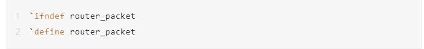

在Verilog和SystemVerilog中，仿真器常常报出多重定义的错误。

最常见的情况就是在写的Testbench中，一般来说，我们首先会创建一个数据包packet类，然后分别在generator、driver、scoreboard等类中调用它，也就是说多个文件包含同一个文件，这时候如何不添加其他语句，仿真器预处理时就会出现多重定义的错误。

- `ifndef 在文件中的作用

在头文件中使用#ifndef #define #endif的语句能避免头文件的重定义。

方法：例如要编写packet.sv时，在文件开头写上两行：



上述语句就可以避免重定义问题了。

那么ta是怎么解决问题的呢？

- 解决过程

首先，ifndef说的如果没定义就执行从`ifndef到`else或者`endif之间的语句，那么仿真器第一次碰到packet时，确实是还没定义router_packet，那么接着执行packet中的内容，并且执行了`define router_packet，好了，预处理一次以后，router_packet已经被定义了，那么以后再碰到需要执行packet时就会不执行ifndef后面的内容了，这样就解决了上述问题。

- ifdef与ifndef怎么用

ifdef：

如果定义了，那么执行ifdef到`else或者`endif之间的内容。

ifndef：

与上面那个相反。

再举个例子，看下：

```text
module tb;
  initial begin
    `ifndef FLAG
    `define FLAG
      $display ("FLAG is defined");
    `endif
    `ifndef FLAG
      $display ("FLAG is defined");
    `endif
  end
endmodule
```

可以看到，打印语句只执行了一次：


- 建议

一般情况下，每个文件，我们最好都添加上ifndef去避免重定义。当然，ifndef与ifdef在其他地方的用处还有很多。

Q:一般情况会每个文件都加上ifndef去避免重定义，还是在会发生重定义情况下加ifndef

A:一般package里的和interface才会，合并多个人写的code的时候才会用到，自己从头写的东西，一般用不上这个，但是一旦你写的这十几个文件要给别人用，再一个个加就比较麻烦