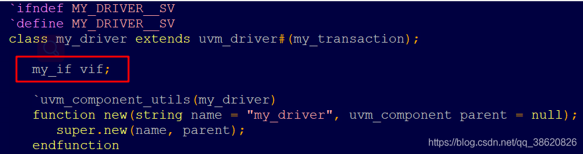

### virtual interface

注意interface可以使用（.*）通过位置连接

```verilog
module ARB_TB();
    bit      clk;        
    arb_if   arbif(.*);    //隐式例化接口（clk信号名一样），等价arb_if arbif(.clk(clk));
    test     u_test(.*);   //隐私例化激励文件
    arb      u_arb(        //通过接口连接TB与DUT
                  .reset_n(arbif.reset_n),
                  .clk    (clk),
                  .request(arbif.request),
                  .grant  (arbif.grant) 
               );
     initial begin
        clk = 0;
        forever #10 clk = ~clk;
     end

endmodule
```


interface 封装了模块的端口(ports)，以及它们的方向（modports），同步关系（ clocking block），function和task。

interface 简化了模块之间的连接,但是无法很好地适用于基于OOP的测试平台，无法在program ，class中进行实例化。

为了解决这个问题， System Verilog引入了virtual interface的概念。virtual interface是实际interface的指针。即virtual interface是一种可以在class中实例化的数据类型，使用virtual interface可与被测设计（DUT）进行间接地通信，而无需使用层次结构引用。


interface将测试平台与DUT分开。virtual interface在测试平台的不同位置操纵一组虚拟信号，而不是直接操纵实际的信号。

```text
interface SBus; // A Simple bus interface
logic [7:0] addr, data;
endinterface

class SBusTransctor; // SBus transactor class
 virtual SBus bus; // virtual interface of type Sbus
 function new( virtual SBus s );
    bus= s; // initialize the virtual interface
 endfunction
endclass

module dev ( Sbus s ) ... endmodule //devices that use SBus

module top
SBus s ; // instantiate  interface
dev a ( s ); // instantiate  device

initial begin
SbusTransactor t; // create  bus-transactors
t = new( s );
end
endmodule
```

在前面的示例中，SbusTransctor是一个简单的可重用事务类，其在编写时不需要知道测试平台的层次结构，也不知道与之交互的特定设计。该事务类可以与符合接口协议的任何数量的设计进行交互。


在测试平台中是virtual interface时，需要满足以下3个要求


1、 实例化的接口必须正确连接到DUT。

```text
SBus s ; // instantiate  interface
dev a ( s ); // instantiate  device
```


2、 必须在类中声明virtual interface句柄。

```text
virtual SBus bus; // virtual interface oftype Sbus
function new( virtual SBus s );
  bus = s; // initialize the virtual interface 
endfunction
```

3、必须将指定模块的interface赋值给virtual interface


```text
SbusTransactor t; // create  bus-transactors
t = new( s );
```

UVM是基于类的验证方法，其需要在driver和monitor两个不同的位置访问DUT，因此在UVM中需要两个virtual interface。

#### virtual task

virtual 是OOP中的一种关键字，主要体现的是多态。虚函数是指一个类中你希望重载的成员函数 ，当你用一个基类指针或引用指向一个继承类对象的时候，调用一个虚函数时, 实际调用的是继承类的版本。整理了uvm中使用virtual常用的四种情况:

virtual interface;
virtual class;
virtual sequence和virtual sequencer;
virtual function和virtual task.
virtual interface
下面图片中my_if是interface类型，在类中对interface例化，如果不使用virtual，则如下面右图所示，直接例化，所有my_if例化的interface值都会发生改变，使用了virtual例化，则每个例化是独立的，改变的只是当前的vif接口的值。




#### virtual class

虚类只用来定义类的格式, 和成员的名字, 参数, 不能被实例化, 只能被重载, 用于在项目中定义一些标准的类, 例如driver类, 这样大家extend出来的driver的基本的格式都是一样的, 易读易理解. 在virtual class里的方法最好使用 pure virtual 修饰, 叫做纯虚方法, 也是用来定义方法的名字和参数列表的, 方便大家统一名字。对于virtual class 必须使用 extends class来进行实体化才可以使用，OOP规定，只要class中存在一个没有实现的pure function，就不允许例化这个class …

#### virtual function 和 virtual task

当在父类中定义一个函数/任务时， 如果将其设置为virtual类型， 那么就可以在子类中重载这个函数/任务。

例如在bird类中定义了两个函数hungry和hungry2，hungry使用virtual类型定义，parrot是bird的子类，子类中也定义了hungry和hungry2函数，这时子类中的hungry函数会重载父类的hungry，而hungry2不是使用virtual定义的，不会发生重载。重载的最大优势是使得一个子类的指针以父类的类型传递时， 其表现出的行为依然是子类的行为。

避免在uvm中出错的最好方式是，如果该class不会被继承，则所有的function/task都不需要加virtual。如果该class会被继承，则用户定义的function/task（除new()/randomized()/per_randomize()/pose_randomize()以外），都应该加上virtual。

#### virtual sequence 和 virtual sequencer

在多个sequence向不同的drive发送数据时，并且这些sequence还存在复杂的同步关系，这时使用virtual sequencer和virtual sequence是非常方便的。下面是sequence发送的三种情况，single drive发送，mult drive但不同的sequence不存在同步关系，这种无需使用virtual sequencer，第三种是mult drive而且发送的sequence还存在同步关系，使用virtual sequencer将是非常方便必要的。

#### 纯虚类(virtual class)和纯虚方法(pure virtual function)