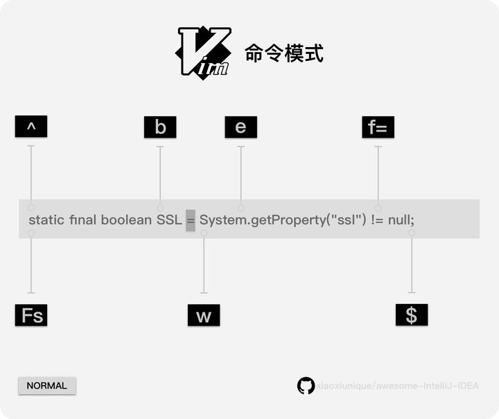

### vscode-vim

https://www.zhihu.com/question/437735833/answer/2160324348

https://guodongm.blog.csdn.net/article/details/115866450

使用jj代替esc


ctrl+，设置

ctrl+` 终端

ctrl+Shift+5拆分终端

ctrl+ 1/2/3/4切换窗口

line height 设置行高：

alt up down

ctrl +b alt+b 关闭侧栏


19G，跳转到19行

viw选中worde

shift +* 跳转到下一个词

### :reg

系统剪切板寄存器“+

无名（unnamed）寄存器：""，缓存最后一次操作内容；
数字（numbered）寄存器："0 - "9，缓存最近操作内容，复制与删除有别；
行内删除（small delete）寄存器："-，缓存行内删除内容；
具名（named）寄存器："a - "z或"A - "Z，指定时可用；
只读（read-only）寄存器：":, "., "%, "#，分别缓存最近命令、最近插入文本、当前文件名、当前交替文件名；
表达式（expression）寄存器："=，只读，用于执行表达式命令；
选择及拖拽（selection and drop）寄存器："*, "+, "~，存取GUI选择文本，可用于与外部应用交互，使用前提为系统剪切板（clipboard）可用；
黑洞（black hole）寄存器："_，不缓存操作内容（干净删除）；
模式寄存器（last search pattern）："/，缓存最近的搜索模式。

模式	英文名	描述
命令模式	command-mode	用于输入指令，如：保存、运行、切换标签、切割屏幕等
插入模式	insert-mode	也即编辑模式，用于编辑文本
可视模式	visual-mode	相当于高亮选取文本后的正常模式
正常模式	normal-mode	用于查看文本，也可复制、粘贴、撤销、重做等

其它模式=>正常模式

esc

正常模式=>插入模式
指令	描述
a	光标所在下一个位置插入
A	光标所在行末尾插入
s	删除光标所在字符并插入
S	删除光标所在行并插入
o	光标所在下一行插入
O	光标所在上一行插入
i	光标所在位置插入
I	光标所在行首插入
R	光标所在位置替换
cw	删除光标所在位置到单词末尾并插入
ch（c+左箭头）	删除上一个字符插入
cj（c+下箭头）	删除当前行和下一行插入
ck（c+上箭头）	删除当前行和上一行插入
cl（c+右箭头）	删除下一个字符插入
其它未尽指令	其它
正常模式=>命令模式
:

正常模式=>可视模式
指令	描述
v	可视模式
ctrl+v	可视块模式
shift+v	可视行模式

```
%` 括号匹配跳转 `() [] {}
```




【:w】 保存⽂件
【:w!】 若⽂件为只读，强制保存⽂件
【:q】 离开vi
【:q!】 不保存强制离开vi
==【:wq】 保存后离开==
【:wq!】 强制保存后离开
【:! command】 暂时离开vi到命令⾏下执⾏⼀个命令后的显⽰结果
【:set nu】 显⽰⾏号
【:set nonu】 取消显⽰⾏号
==【:w newfile】 另存为==
【:set fileencoding】 查看当前⽂件编码格式
【:set fileencoding=utf-8】 设置当前⽂件编码格式为utf-8，也可以设置成其他编码格式
【:set fileformat】 查看当前⽂件的断⾏格式（dos\windows,unix或macintosh）

【:set fileformat=unix】 将当前⽂件的断⾏格式设置为unix格式


vim下查看当前目录
==:!ls==

1、水平窗口分割：
   ：split（开启另一个窗口察看同一文件）
   ：split 文件名（开启另一个窗口察看指定文件）
2、垂直窗口分割：
   ：vsplit（开启另一个窗口察看同一文件）
：vsplit 文件名（开启另一个窗口察看指定文件）
3、在窗口之间进行切换：
  cntl+w+w，按住cntl键，同时按下两次w键。从一个窗口切换到另一个窗口
4、增大或减少窗口大小：
  cntl,+/- ，0（还原）
5、关闭当前文件：
  1）将光标切换到当前窗口下，然后按照关闭单个窗口的方法关闭窗口。例如：q命令。
  2）关闭所有窗口文件：在所有关闭单个窗口的命令中加上all，例如：qall命令。
  3）关闭除当前窗口之外的文件。：only。


1.复制

1）单⾏复制
在命令模式下，将光标移动到将要复制的⾏处，按“yy”进⾏复制；
2）多⾏复制在命令模式下，将光标移动到将要复制的⾸⾏处，按“nyy”复制n⾏；其中n为1、2、3……
【yy】 复制光标所在的那⼀⾏
【nyy】 复制光标所在的向下n⾏
2、粘贴
在命令模式下，将光标移动到将要粘贴的⾏处，按“p”进⾏粘贴
【p,P】 p为将已经复制的数据在光标下⼀⾏粘贴；P为将已经复制的数据在光标上⼀⾏粘贴
3、删除
删除⼀⾏：dd
删除⼀个单词/光标之后的单词剩余部分：dw
删除当前字符：x
光标之后的该⾏部分：d$
⽂本删除
dd 删除⼀⾏
d$ 删除以当前字符开始的⼀⾏字符
ndd 删除以当前⾏开始的n⾏
dw 删除以当前字符开始的⼀个字
ndw 删除以当前字符开始的n个字
4、查找
【/word】 在⽂件中查找内容为word的字符串（向下查找）
【?word】 在⽂件中查找内容为word的字符串（向上查找）
【[n]】 表⽰重复查找动作，即查找下⼀个
【[N]】 反向查找下⼀个

- 按半屏滚动
    Ctrl + D 屏幕向下滚动半屏
    Ctrl + U 屏幕向上滚动半屏

zz光标居中

Vim 可以用来查看和编辑二进制文件
vim -b xxx.bin  #加上-b参数，以二进制打开
然后输入命令 :%!xxd -g 1 切换到十六进制模式显示