eddrA-test测试工程：set_property PACKAGE_PIN H22 [get_ports {c0_ddr4_dm_dbi_n[2]}]，H22为ddrB的物理管脚，也就是说，ddr的dm管脚是两组ddr共用的，如下图，A组比B组少8个管脚。例程为app接口，example生成。

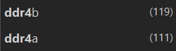

DDR测试

例程A测试通过，出现invalidCore现象，需要在对给mig的复位信号取反，因为没法按sw1拨号按键。

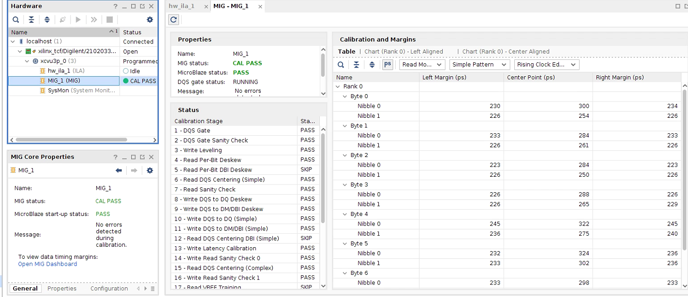

### pcie

驱动安装

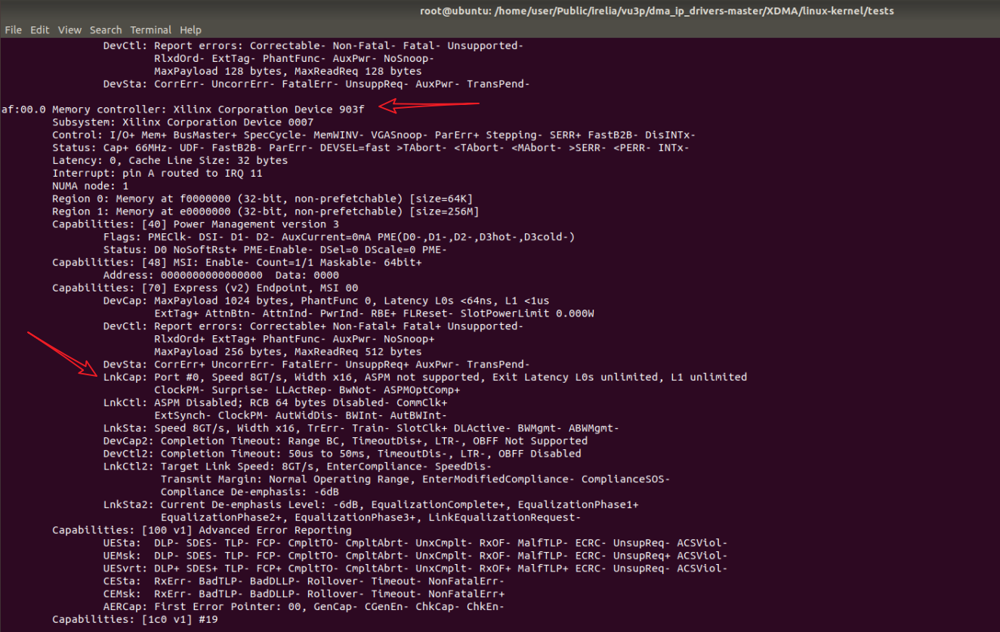

经过在linux下的xdma测试，对vu3p烧写bit文件和itx文件，然后reboot，之后load_device，便可用ls /dev/xdma*查看加载好的xdma设备。当添加flash设备并固化msc文件时，断电重启会发现之前添加的flash设备丢失了，且无法成功加载设备，原因不明。是因为vivado在打开工程的时候没打开所烧写或固化程序对应的工程，或者是因为直接从首页开启了硬件管理面板，导致面板加载不到程序。

在板卡烧写bit文件reboot，load了以下设备

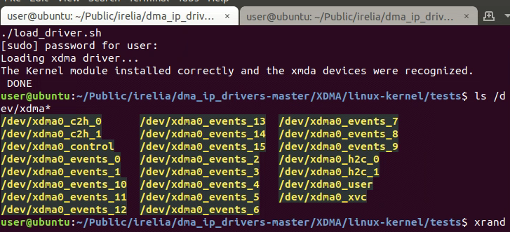

使用以下命令

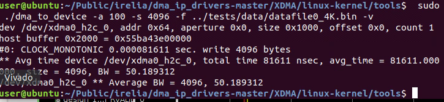

发送以下文件的数据，使用vim -b查看，vim命令：%！xxd显示

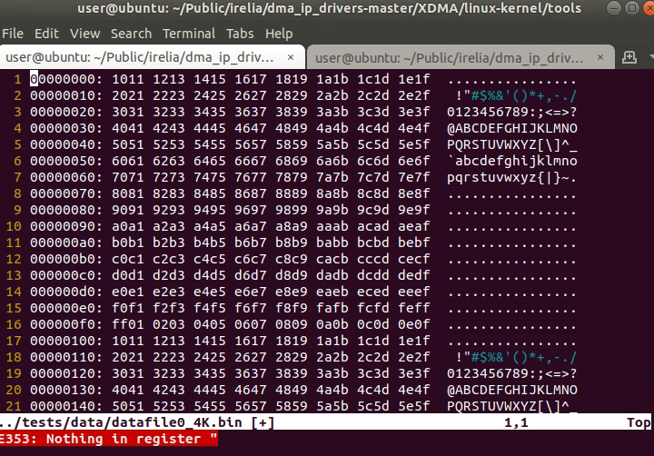

在vivado中用ila抓取写入的数据

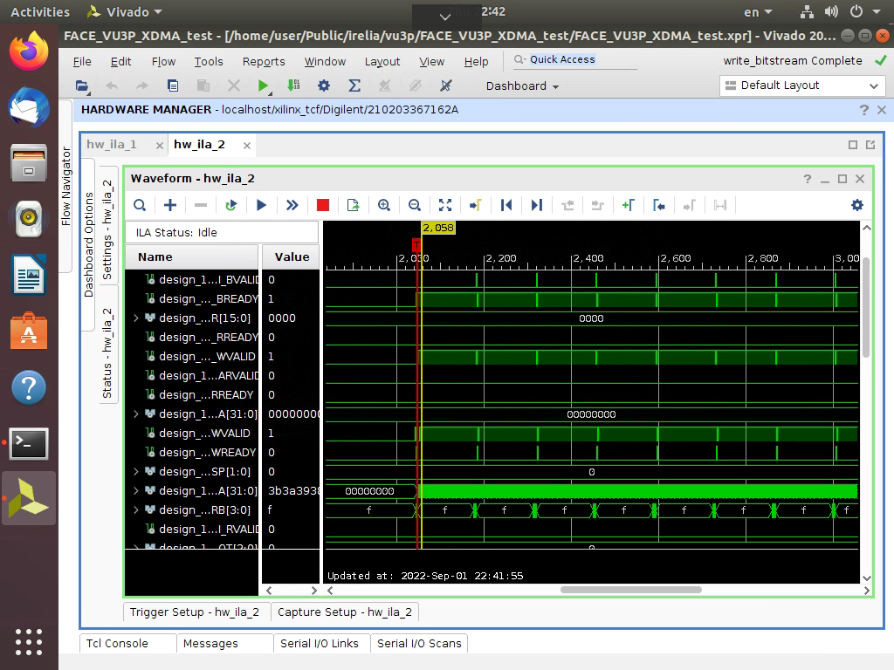

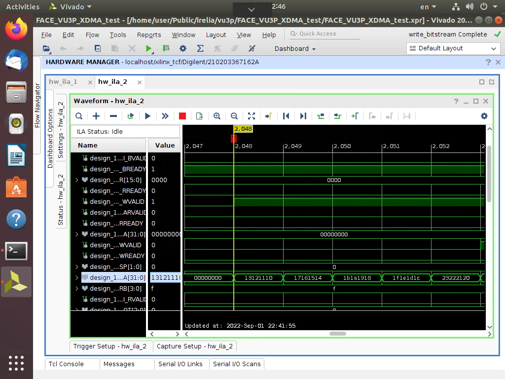

下面是对寄存器的测试，使用命令

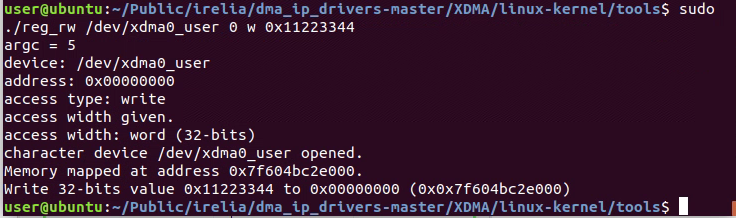

同样在另一个ila中抓取写入的数据

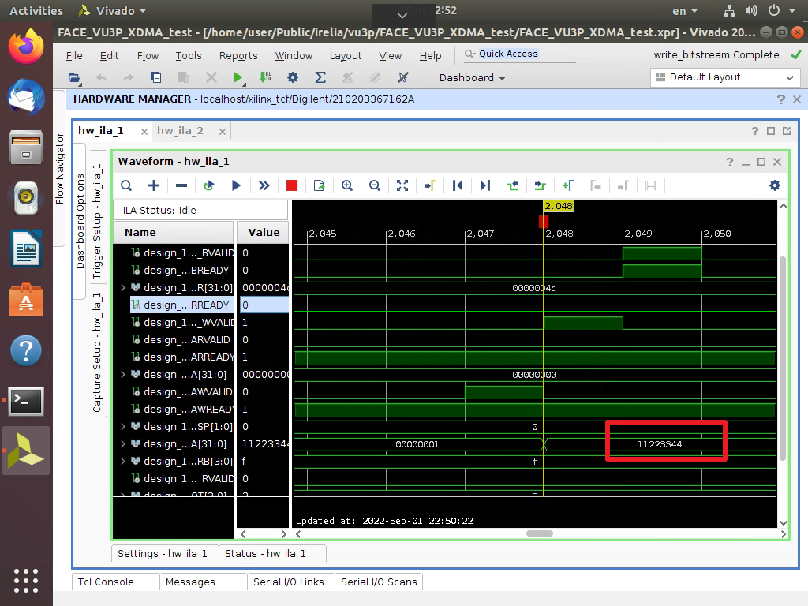

上面写入的数据分别进入以下板卡地址

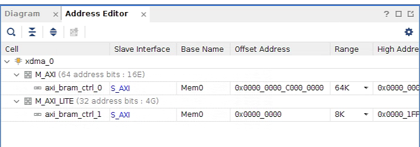