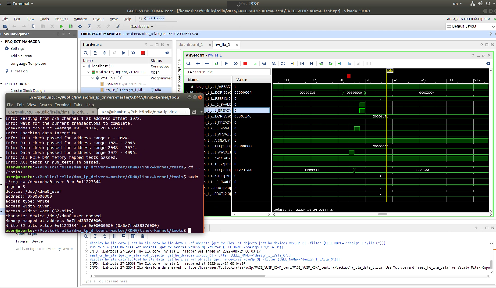

ddrA-test测试工程：set_property PACKAGE_PIN H22 [get_ports {c0_ddr4_dm_dbi_n[2]}]，H22为ddrB的物理管脚，也就是说，ddr的dm管脚是两组ddr共用的，如下图，A组比B组少8个管脚。例程为app接口，example生成。

DDR测试

例程A测试通过，出现invalidCore现象，需要在对给mig的复位信号取反，因为没法按sw1拨号按键。

### pcie

驱动安装

